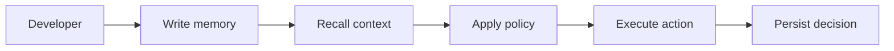

# Start Here

This page gets you to a working Aionis integration in minutes.

## Metadata

- 📖 8 minutes
- ⚙️ Docker and Docker Compose., Node.js `>=18`., `curl` and `jq`.
- 🎯 You can run Aionis and validate first write/recall integration.
- 📝 Run Aionis locally. · Perform a recallable write. · Verify retrieval and replay-ready IDs.


## End-to-end flow



## Local quickstart

```bash
git clone https://github.com/Cognary/Aionis.git
cd Aionis
cp .env.example .env
npm run -s env:bundle:local-safe
```

If you want a more evaluation-oriented local bundle for recall and context optimization:

```bash
npm run -s env:bundle:experimental
```

Recommended local `.env` values:

```bash
PORT=3001
MEMORY_AUTH_MODE=off
EMBEDDING_PROVIDER=fake
```

Start the stack:

```bash
make stack-up
curl -fsS http://localhost:3001/health | jq
```

Write and recall:

```bash
curl -sS http://localhost:3001/v1/memory/write \
  -H 'content-type: application/json' \
  -d '{
    "tenant_id":"default",
    "scope":"default",
    "input_text":"Customer prefers email follow-up",
    "memory_lane":"shared",
    "nodes":[{"type":"event","memory_lane":"shared","text_summary":"Customer prefers email follow-up"}]
  }' | jq

curl -sS http://localhost:3001/v1/memory/recall_text \
  -H 'content-type: application/json' \
  -d '{"tenant_id":"default","scope":"default","query_text":"preferred follow-up channel","limit":5}' | jq
```

Stop services:

```bash
make stack-down
```

## Hosted quickstart

```bash
export BASE_URL="https://api.your-domain.com"
export API_KEY="your_api_key"

curl -fsS "$BASE_URL/health" | jq

curl -sS "$BASE_URL/v1/memory/write" \
  -H 'content-type: application/json' \
  -H "X-Api-Key: $API_KEY" \
  -d '{
    "tenant_id":"default",
    "scope":"default",
    "input_text":"hosted onboarding write",
    "memory_lane":"shared",
    "nodes":[{"type":"event","memory_lane":"shared","text_summary":"hosted onboarding write"}]
  }' | jq
```

## Bundle shortcuts

If you want copy-ready `.env` presets instead of flipping feature flags manually:

```bash
npm run -s env:bundle:local-safe
npm run -s env:bundle:experimental
npm run -s env:bundle:team-shared
npm run -s env:bundle:high-risk
```

Guide:

1. [Tutorial: Feature Bundles](/guide/tutorials/feature-bundles)

## Success criteria

1. `/health` returns healthy status.
2. `write` returns `request_id` and commit fields.
3. `recall_text` returns candidate/context data.
