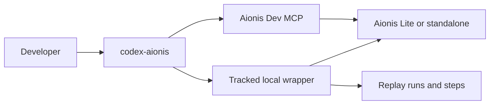

<div class="doc-hero doc-hero-start">
  <span class="status-pill stable">Official Integration</span>
  <h1>Codex Local Profile</h1>
  <p class="doc-hero-subtitle">
    Aionis Codex Local Profile is the official local integration path for Codex users.
    Start with Lite for the fastest local path, or use the tracked standalone profile when you want the legacy Docker-shaped route.
  </p>
  <div class="doc-hero-strip">
    <span>Lite + Dev MCP</span>
    <span>Tracked standalone</span>
    <span>Continuation-first coding loop</span>
  </div>
  <div class="doc-hero-panel">
    <div class="doc-hero-grid">
      <div class="doc-hero-chip active">run_start</div>
      <div class="doc-hero-chip">planning_context</div>
      <div class="doc-hero-chip accent">step_recording</div>
      <div class="doc-hero-chip">run_end</div>
    </div>
    <div class="doc-hero-meta">
      <span>run_id</span>
      <span>decision_id</span>
      <span>commit_uri</span>
      <span>replay_step</span>
    </div>
  </div>
</div>

## What this profile is

This profile gives Codex an Aionis-backed local workflow. You can use it in two modes:

1. **Lite + Dev MCP** for the shortest local path
2. **Tracked standalone profile** for the older Docker-shaped local loop

In both cases, the goal is the same: local coding tasks should be replayable, inspectable, and easier to continue later.

## Who should use it

Use Codex Local Profile when you want:

1. Codex to access Aionis memory, replay, planning, and learn-from-run capabilities
2. local coding sessions to preserve a stable `run_id` and step trail
3. build, test, and lint commands to show up as replayable local execution steps
4. one productized path instead of hand-assembling scripts, Docker commands, and MCP config

## What happens by default

When you launch Codex through `codex-aionis`, the local loop becomes:

1. Aionis starts a tracked run
2. planning context is assembled for the session
3. local command steps can be recorded into replay history
4. the run is closed automatically at session end

That gives local development a usable provenance chain instead of ad hoc shell history.

## Architecture



## 3-minute setup

### 1. Fastest path: Lite + Dev MCP

Start Lite:

```bash
npm run build
npm run start:lite
```

Check health:

```bash
curl -fsS http://localhost:3001/health | jq '{aionis_edition,memory_store_backend}'
```

Expected:

1. `aionis_edition = "lite"`
2. `memory_store_backend = "lite_sqlite"`

### 2. Tracked standalone path

Use this when you want the Docker-shaped tracked profile:

```bash
npm run -s mcp:aionis:dev:standalone:oneclick
```

This starts a local standalone runtime, waits for health, and validates the built-in Dev MCP path.

### 3. Generate Codex setup guidance

```bash
npm run -s aionis:setup:codex
```

This prints:

1. the recommended `aionis-dev` MCP configuration
2. the recommended local launcher command
3. the environment values currently expected by the profile

### 4. Install and verify the local launcher

```bash
npm run -s aionis:install:codex-launcher
codex-aionis-doctor
```

When the doctor passes, the local runtime, launcher, and replay loop are wired correctly.

## The two commands most users need

For most users, the product surface is only two commands:

```bash
codex-aionis-doctor
```

```bash
codex-aionis \
  --root /path/to/workspace \
  --title "Fix a regression" \
  --goal "Diagnose and fix the bug without breaking MCP behavior." \
  --query "Investigate the regression and preserve the local replay loop." \
  -- codex
```

`codex-aionis` is the product entrypoint. It is the shortest supported path to a tracked local Codex session.

## What Codex gets through Dev MCP

The built-in Dev MCP exposes the Aionis capabilities that matter most in coding workflows:

1. memory write and recall
2. planning context
3. tool selection, decision, run, and feedback hooks
4. replay run and replay step recording
5. playbook compilation and run reuse
6. local quality gate and learn-from-run flow

## Recording local command steps

Inside a live session, common commands can be recorded as replay steps:

```bash
AIONIS_RUN_ID=<run-id> \
AIONIS_SESSION_ROOT=/path/to/workspace \
bash /path/to/Aionis/scripts/aionis-build
```

Also available:

1. `bash /path/to/Aionis/scripts/aionis-test`
2. `bash /path/to/Aionis/scripts/aionis-lint`

These helpers are useful when you want the local replay trace to reflect what actually happened during debugging or validation.

## Supported deployment shape

This profile is designed for local use:

1. Aionis runs as Lite or standalone Docker
2. Codex runs on the host
3. the MCP client starts the built-in Dev MCP through the host launcher
4. the local wrapper coordinates session start, step recording, and session end

This is a productized local workflow, not a remote multi-tenant MCP gateway.

If your first goal is simply to try Aionis locally, start with [Lite Public Beta](lite-public-beta) before choosing the tracked standalone path.

## Troubleshooting

If the profile does not behave as expected, check these first:

1. the runtime is actually running
2. `codex-aionis-doctor` passes
3. `codex mcp list` shows `aionis-dev`

The shortest checks are:

```bash
codex-aionis-doctor
codex mcp list
```

## Related pages

1. [Lite Public Beta](lite-public-beta)
2. [Choose Lite or Server](choose-lite-or-server)
3. [Integrations](integrations)
4. [Quickstart](quickstart)
