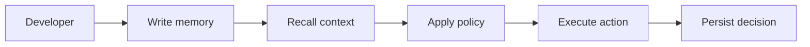

<div class="doc-hero doc-hero-start">
  <span class="status-pill stable">Quickstart</span>
  <h1>Quickstart</h1>
  <p class="doc-hero-subtitle">
    This page gets you to a working Aionis integration in minutes.
    Start with Lite for the shortest path, or use Server if you are validating the self-hosted production route.
  </p>
  <div class="doc-hero-strip">
    <span>Health check</span>
    <span>Write memory</span>
    <span>Recall context</span>
  </div>
  <div class="doc-hero-panel">
    <div class="doc-hero-grid">
      <div class="doc-hero-chip active">/health</div>
      <div class="doc-hero-chip">memory.write</div>
      <div class="doc-hero-chip accent">memory.recall_text</div>
      <div class="doc-hero-chip">commit.persist</div>
    </div>
    <div class="doc-hero-meta">
      <span>tenant_id</span>
      <span>scope</span>
      <span>request_id</span>
      <span>commit_uri</span>
    </div>
  </div>
</div>

## What you will do

1. Run Aionis locally or point to a hosted environment.
2. Write one recallable memory event.
3. Recall that memory by text.
4. Capture the identifiers you will need later for replay and debugging.
5. Leave this page with one verified end-to-end success path.

## Before you start

1. Node.js `>=22` for Lite.
2. Docker and Docker Compose if you want the Server-oriented local path.
3. `curl` and `jq` for the validation steps below.

## Choose your path

1. Use **Lite** if you want the fastest hands-on validation from this repository.
2. Use **Server** if you want the self-hosted production-shaped local path.
3. Use the hosted quickstart if you already have a running Aionis environment and credentials.
4. If you are evaluating the product first, read [Choose Lite or Server](choose-lite-or-server) and [Overview](overview).

## End-to-end flow



## Lite quickstart

Use Lite if you want the shortest route to a real Aionis workflow:

Clone and configure the repository:

```bash
git clone https://github.com/Cognary/Aionis.git
cd Aionis
cp .env.example .env
```

Use these local `.env` defaults for a first smoke path:

```bash
PORT=3001
AIONIS_EDITION=lite
```

Start Lite and confirm health:

```bash
npm run build
npm run start:lite
curl -fsS http://localhost:3001/health | jq
```

Write one recallable event and verify recall:

```bash
curl -sS http://localhost:3001/v1/memory/write \
  -H 'content-type: application/json' \
  -d '{
    "tenant_id":"default",
    "scope":"default",
    "input_text":"Customer prefers email follow-up",
    "memory_lane":"shared",
    "nodes":[{"type":"event","memory_lane":"shared","text_summary":"Customer prefers email follow-up"}]
  }' | jq

curl -sS http://localhost:3001/v1/memory/recall_text \
  -H 'content-type: application/json' \
  -d '{"tenant_id":"default","scope":"default","query_text":"preferred follow-up channel","limit":5}' | jq
```

Canonical Lite validation:

```bash
npm run -s lite:dogfood
```

## Server quickstart

Use Server if you want the self-hosted production-shaped local path:

```bash
git clone https://github.com/Cognary/Aionis.git
cd Aionis
cp .env.example .env
```

Use these local `.env` defaults:

```bash
PORT=3001
MEMORY_AUTH_MODE=off
EMBEDDING_PROVIDER=fake
```

Start the stack and confirm health:

```bash
make stack-up
curl -fsS http://localhost:3001/health | jq
```

Stop services when finished:

```bash
make stack-down
```

## Hosted quickstart

If you already have a hosted Aionis environment, use the same validation path:

```bash
export BASE_URL="https://api.your-domain.com"
export API_KEY="your_api_key"

curl -fsS "$BASE_URL/health" | jq

curl -sS "$BASE_URL/v1/memory/write" \
  -H 'content-type: application/json' \
  -H "X-Api-Key: $API_KEY" \
  -d '{
    "tenant_id":"default",
    "scope":"default",
    "input_text":"hosted onboarding write",
    "memory_lane":"shared",
    "nodes":[{"type":"event","memory_lane":"shared","text_summary":"hosted onboarding write"}]
  }' | jq
```

## What success looks like

1. `/health` returns healthy status.
2. `write` returns `request_id` and commit fields.
3. `recall_text` returns candidate or context data.
4. You can identify which IDs to keep for later replay and debugging.

## What to persist from your first run

1. `request_id`
2. `tenant_id`
3. `scope`
4. `data.commit_id`
5. `data.commit_uri`

## What to read next

1. [Choose Lite or Server](choose-lite-or-server)
2. [Core Concepts](core-concepts)
3. [Memory and Policy Loop](memory-policy-loop)
4. [API Guide](api-guide)
5. [SDK Guide](sdk-guide) if you do not want to stay at raw HTTP level

## If you are a Codex user

If your goal is to run Codex locally with the built-in Dev MCP and a tracked replay loop, do not stop at this page.

Use [Codex Local Profile](codex-local-profile) for the productized path that combines:

1. Aionis Lite or standalone Docker
2. Aionis Dev MCP
3. `codex-aionis` as the tracked launcher
