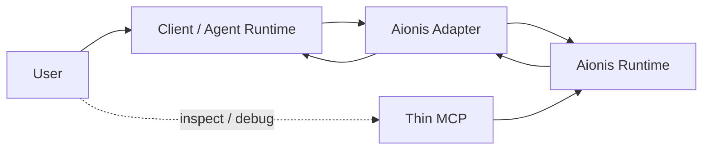

# Aionis Adapter Direction

## Summary

Aionis should not treat MCP as the primary product form.

The better long-term shape is:

1. `adapter` as the main execution path
2. `thin MCP` as a secondary integration and introspection layer

This keeps Aionis useful in MCP-native ecosystems without forcing the core product experience to depend on tool-calling behavior that the model or client may apply inconsistently.

## Why This Direction

The current thin MCP already proves that Aionis can expose stable execution-memory capabilities:

1. planning guidance
2. tool-selection guidance
3. task finalization
4. learned-state introspection

But MCP has a structural limit:

1. it can expose tools
2. it cannot reliably force a client to call those tools at the right time
3. it does not naturally see the full execution trace unless the client explicitly forwards it

That means MCP is strong as a compatibility and visibility layer, but weak as the primary control surface for automatic execution-memory learning.

## Product Judgment

The product should be framed as:

1. users install or enable an Aionis adapter in their agent/runtime
2. users work normally
3. Aionis automatically participates in the execution loop
4. users optionally inspect learned state through MCP or another operator surface

The product should not be framed as:

1. users manually invoke Aionis tools
2. users repeatedly remind the model to use Aionis
3. users rely on prompt choreography to close the learning loop

## User Path

### Main Path: Adapter

The desired user experience is:

1. install or enable the Aionis adapter
2. keep using Claude Code, an IDE agent, or another execution client as normal
3. Aionis automatically:
   - gets planning guidance at task start
   - shapes tool selection before execution
   - records outcome evidence after execution
   - finalizes task-level learning at task completion or blockage
   - improves future guidance on similar work

In this path, the user does not need to think in terms of Aionis tools.

### Secondary Path: Thin MCP

The thin MCP remains valuable, but for narrower jobs:

1. ecosystems that already prefer MCP integration
2. builders who want a fast integration surface
3. operator inspection and demo flows
4. debugging or validation of learned state

In this path, MCP is not the main learning path. It is the compatibility and observation layer.

## Architecture Direction

### Adapter Responsibilities

The adapter should own:

1. task-start guidance retrieval
2. pre-tool selection interception
3. execution evidence collection
4. task-boundary finalization
5. forwarding normalized execution context to Aionis

### Thin MCP Responsibilities

The thin MCP should keep owning:

1. planning-context access
2. tool-selection access
3. finalize-task access
4. introspection access
5. compatibility for MCP-native clients that do not support a deeper adapter

## Why Adapter Is Better For The Mainline

### 1. Better automation

An adapter can consistently run at the right moments in the execution loop.

MCP depends on the client or model deciding to call a tool.

### 2. Better evidence quality

An adapter can see:

1. what tool actually ran
2. what happened after the tool ran
3. whether the task completed, failed, or was blocked

This produces cleaner learning signals than pure conversational prompting.

### 3. Better user experience

The user path becomes:

1. enable Aionis
2. work normally
3. inspect learning only when desired

This is much closer to a product than to a manual orchestration workflow.

### 4. Better product boundary control

Aionis can keep MCP thin and stable while moving richer automation logic into the adapter layer, where execution-loop semantics belong.

## What This Does Not Mean

This direction does not mean:

1. remove MCP
2. stop supporting MCP-native builders
3. move every API into the adapter

It means:

1. do not make MCP the main product experience
2. do not depend on prompt habits as the core learning loop
3. keep MCP thin, stable, and useful
4. move the real execution-loop automation into an adapter

## Recommended Execution Order

### Phase 1: Keep Thin MCP Stable

Done or already underway:

1. stable planning/select/finalize/introspect tools
2. generic feedback learning fallback
3. task-boundary finalization path

### Phase 2: Design Adapter Contract

Done:

1. define the adapter event model
2. define how execution evidence is captured
3. define task lifecycle hooks
4. define the minimal client integration surface

### Phase 3: Implement First Adapter

In progress:

1. a first source-owned adapter baseline now exists under `src/adapter/`
2. it already covers task start, pre-tool selection, execution evidence, task finalization, and a first Claude Code bridge contract
3. the remaining gap is real client wiring, not the adapter contract itself

### Phase 4: Keep MCP As Compatibility Layer

Ongoing:

1. preserve thin MCP for inspection and easy ecosystem integration
2. avoid growing MCP into a second full control plane

## Decision

The recommended product direction is:

1. adapter-first for the real user experience
2. thin MCP as a secondary integration and operator layer

That is the cleanest way to make Aionis feel automatic to end users without losing the distribution and compatibility benefits of MCP.
