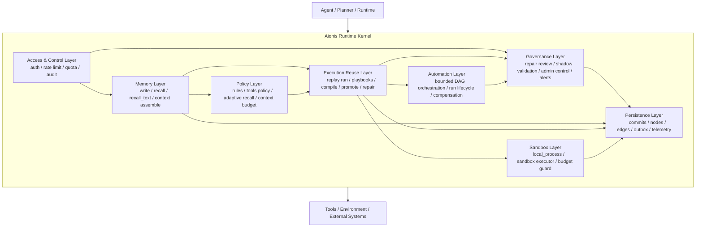
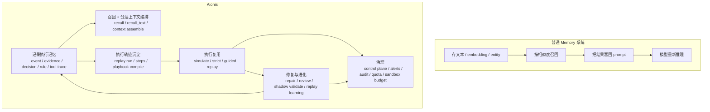

# Aionis Runtime Kernel 架构定位说明

## 文档目的

这份文档用于回答三个核心问题：

1. Aionis 现在是否已经具备减少 Agent 执行期 token 消耗的能力。
2. Aionis 当前是否已经不只是“记忆系统”，而是一个更完整的运行时内核。
3. 应该如何准确描述 Aionis 与普通 Memory 系统、Workflow 系统、Agent Runtime 的关系。

本文结论基于当前仓库实现，而不是未来规划。

---

## 核心结论

### 结论一：Aionis 已经能够在相当一部分 Agent 场景中降低 token 消耗

但它降低的主要不是“模型内部思维本身的 token”，而是以下两类消耗：

1. 重复任务中的重复推理 token  
   通过 execution memory、replay、playbook reuse，把已经跑通过的路径转成可复用执行资产，减少每次从零规划和从零推理的需要。

2. 上下文构造时的上下文 token  
   通过 recall budget、context compaction、layered context assembly，把喂给模型的上下文压缩到预算内，避免历史信息无边界膨胀。

因此，更准确的表述不是：

> Aionis 能自动压缩所有 token 消耗。

而应该是：

> Aionis 能通过执行复用和上下文预算控制，显著降低 Agent 的重复推理成本和上下文注入成本。

### 结论二：Aionis 已经非常接近一个 memory-centered runtime kernel

它已经不是单点 memory 插件，而是把以下能力串成一个闭环：

- 记忆
- 执行
- 复用
- 进化
- 治理

如果必须给一个架构定义，我会这样定义：

> Aionis 是一个以 execution memory 为中心的 Agent Runtime Kernel。

### 结论三：Aionis 不是“全包式 Agent OS”，但已经超出传统 Memory Layer

它当前更像：

- 一个 execution memory kernel
- 一个 replay and automation reuse engine
- 一个 governance-first control loop

它还不是：

- 通用多 Agent 操作系统
- 任意工作流编排平台
- 大而全的模型运行平台

这点非常重要，因为 Aionis 的边界感正是它的优势之一。

---

## 一、Aionis 如何减少 token 消耗

## 1.1 不是直接压缩模型思维，而是减少“必须思考”的次数

普通 Agent 在执行同类任务时，经常会重复做这几件事：

- 重复阅读历史
- 重复理解任务模式
- 重复选择工具
- 重复规划步骤
- 重复试错

Aionis 的执行记忆设计，目标就是把“任务是怎么做成的”沉淀下来，而不是只保存一段文本结果。

仓库里对此的公开表述已经比较明确：

- [README.md](../README.md) 把 Aionis 定义为 `memory kernel`
- [README.md](../README.md) 明确写到：Aionis records execution traces and compiles them into replayable workflows
- [README.md](../README.md) 明确写到：Replay focuses on actions, not LLM token streams

这意味着 Aionis 的省 token 方式是：

- 用 replay 替代重复 reasoning
- 用 compiled playbook 替代重复 trial-and-error
- 用 governed repair 替代每次失败都重新从头推理

这是一种“减少重复认知劳动”的架构思路。

## 1.2 Aionis 已经具备显式的上下文预算控制

在当前实现里，Aionis 已经不只是召回记忆，还在显式控制上下文体积。

核心实现包括：

- [src/memory/context.ts](../src/memory/context.ts)
- [src/memory/context-orchestrator.ts](../src/memory/context-orchestrator.ts)
- [src/index.ts](../src/index.ts)

[src/memory/context.ts](../src/memory/context.ts) 已经包含：

- `estimateTokenCountFromText`
- `context_token_budget`
- `context_char_budget`
- `context_compaction_profile`
- compaction diagnostics

[src/memory/context-orchestrator.ts](../src/memory/context-orchestrator.ts) 已经包含：

- layer 级别 budget
- layer 级别 item 限制
- total budget 控制
- deterministic layered context merge

[src/index.ts](../src/index.ts) 中的这些入口已经在使用这套机制：

- `/v1/memory/recall_text`
- `/v1/memory/planning/context`
- `/v1/memory/context/assemble`

所以，从实现上说，Aionis 已经具备：

1. 检索前后 context 组织能力
2. context token 估算能力
3. context budget 约束能力
4. 按 layer 做结构化压缩能力

这不是“也许能省 token”，而是已经在代码层面明确做了 token-oriented context control。

## 1.3 Aionis 省 token 的前提条件

Aionis 并不是在所有场景都天然省 token，它更适合以下任务：

- 高频重复任务
- 步骤结构相对稳定的任务
- 有明确成功路径的任务
- 可以 replay 的任务
- 可以从 execution trace 中抽象出 reusable playbook 的任务

相反，在这些场景里，Aionis 的收益会弱一些：

- 一次性探索任务
- 强开放世界任务
- 高度创造性任务
- 首次执行且没有历史资产的任务
- repair/guided mode 频繁触发的任务

所以准确结论应当是：

> Aionis 擅长降低长期、重复、结构化 Agent 任务的 token 成本，而不是承诺所有任务单次调用都更省。

---

## 二、Aionis 是否已经成为运行时内核

## 2.1 从能力面看，答案基本是“是”

如果把一个 Agent Runtime Kernel 理解为：

- 负责记录执行状态
- 负责决定如何取回有效上下文
- 负责把成功执行转成可复用资产
- 负责对失败进行修复、评审和再验证
- 负责用治理机制控制执行边界

那么 Aionis 现在已经覆盖了这些关键能力。

从当前代码入口可以直接映射出这几个层次：

### 记忆层

- [src/memory/write.ts](../src/memory/write.ts)
- [src/memory/recall.ts](../src/memory/recall.ts)
- [src/memory/context.ts](../src/memory/context.ts)
- [src/memory/context-orchestrator.ts](../src/memory/context-orchestrator.ts)

### 策略层

- [src/memory/rules-evaluate.ts](../src/memory/rules-evaluate.ts)
- [src/memory/tools-select.ts](../src/memory/tools-select.ts)
- [src/app/recall-policy.ts](../src/app/recall-policy.ts)

### 执行复用层

- [src/memory/replay.ts](../src/memory/replay.ts)
- [src/routes/memory-replay-core.ts](../src/routes/memory-replay-core.ts)

### 自动化层

- [src/memory/automation.js](../src/memory/automation.js)
- [src/routes/automations.ts](../src/routes/automations.ts)

### 治理与控制层

- [src/control-plane.ts](../src/control-plane.ts)
- [src/routes/admin-control-alerts.ts](../src/routes/admin-control-alerts.ts)
- [src/routes/admin-control-config.ts](../src/routes/admin-control-config.ts)
- [src/routes/admin-control-dashboard.ts](../src/routes/admin-control-dashboard.ts)
- [src/routes/admin-control-entities.ts](../src/routes/admin-control-entities.ts)

### 沙箱与预算层

- [src/memory/sandbox.js](../src/memory/sandbox.js)
- [src/app/sandbox-budget.ts](../src/app/sandbox-budget.ts)
- [src/routes/memory-sandbox.ts](../src/routes/memory-sandbox.ts)

### 访问控制与运行时装配层

- [src/app/runtime-services.ts](../src/app/runtime-services.ts)
- [src/app/request-guards.ts](../src/app/request-guards.ts)
- [src/index.ts](../src/index.ts)

这些模块合在一起，已经明显不是普通的 memory 插件结构。

## 2.2 它的中心不是“Workflow Engine”，而是“Execution Memory”

这一点需要特别澄清。

如果只看 replay、automation、repair、control-plane，很容易误判 Aionis 是一个 workflow engine。

但 Aionis 的真实中心仍然是：

> execution memory

也就是说：

- replay 不是孤立工作流功能，而是 execution memory 的复用形式
- automation 不是独立 BPM/流程平台，而是 replay 上面的一层 bounded orchestrator
- governance 不是独立审计系统，而是围绕 replay/repair 生命周期存在

这一点和普通 workflow 系统有本质区别。

在 workflow 系统里，流程是第一性对象。

在 Aionis 里，第一性对象是：

- run
- step
- event
- evidence
- rule
- decision
- playbook

也就是说，Aionis 是从“执行资产”而不是“流程图”出发。

## 2.3 它还不是全包式 Agent OS

虽然 Aionis 已经非常像 runtime kernel，但仍然不应把它描述成全包式 Agent OS。

原因包括：

1. 它没有试图接管通用 planner 本体  
   planner 可以在 Aionis 外部，Aionis 更像执行记忆层和执行闭环层。

2. automation 明确保持 bounded orchestrator 定位  
   [README.md](../README.md) 明确写了：Automation remains a thin orchestrator, not a general-purpose workflow engine.

3. 它没有把所有 agent runtime concerns 都统一抽象  
   例如模型调度、multi-agent messaging、general task queue fabric，并不是它当前的中心。

因此更准确的定义不是：

> Aionis 是 Agent 操作系统。

而是：

> Aionis 是以 execution memory 为中心、覆盖执行复用与治理闭环的 runtime kernel。

---

## 三、Aionis 的运行时分层

下面这张图描述 Aionis 当前比较准确的分层结构。

### 对这张图的解读

1. Access & Control 是最外层  
   说明 Aionis 不是裸 API 集合，而是把鉴权、限流、配额、审计一起纳入运行时边界。

2. Memory Layer 是中心输入层  
   所有能力最终都围绕 write/recall/context 组织。

3. Policy Layer 是 memory 到 execution 的桥  
   Aionis 不是“检索完就塞 prompt”，而是会经过 rule、tool、budget、adaptive controls。

4. Execution Reuse Layer 是核心差异层  
   replay/playbook 才是 Aionis 与普通 memory 系统真正拉开差距的地方。

5. Governance Layer 不是附属功能  
   repair review、shadow validation、admin control 在这里是主链路，不是事后补丁。

---

## 四、Aionis 的闭环演化结构

下面这张图更适合描述 Aionis 的动态闭环，而不是静态分层。

```mermaid
flowchart LR
    A["Agent executes task"] --> B["Memory Write
    events / evidence / decisions / rules"]
    B --> C["Recall & Context Assembly
    recall / recall_text / planning / layered context"]
    C --> D["Action Execution
    tools / sandbox / runtime environment"]
    D --> E["Replay Trace Recording
    run start / step before-after / run end"]
    E --> F["Compile Playbook
    successful run -> reusable procedure"]
    F --> G["Replay Run
    simulate / strict / guided"]
    G --> H["Repair & Review
    patch / review / shadow validate / promote"]
    H --> I["Automation
    bounded DAG orchestration / compensation / recovery"]
    I --> J["Governance & Control
    alerting / admin control / audit / quota / budget"]
    J --> K["Policy Feedback
    rule feedback / tool feedback / replay learning"]
    K --> B
```

### 对这张图的解读

普通 memory 系统通常只覆盖：

- 写入
- 检索
- 回填 prompt

而 Aionis 现在已经覆盖：

- 写入
- 检索与上下文构造
- 执行轨迹记录
- 执行复用
- 修复与进化
- 自动化
- 治理
- 反馈回写

这就是为什么它更像 runtime kernel，而不是 memory addon。

---

## 五、Aionis 与普通 Memory 系统的结构差异

### 差异总结

普通 Memory 系统解决的是：

> 记住什么

Aionis 解决的是：

> 怎么做过、怎么复用、怎么修、怎么管

所以二者的差异不是“检索更强一些”，而是架构范式不同。

---

## 六、Aionis 当前的最准确定义

基于当前仓库实现，我认为最准确的定义是：

> Aionis 是一个以 execution memory 为中心的 Agent Runtime Kernel。  
> 它把记忆、上下文组织、执行复用、修复进化和治理控制，收敛进同一个运行时闭环。

这个定义比下面几种说法都更准确：

### 不是单纯的 Memory 数据库

因为它已经有：

- replay
- automation
- governance
- sandbox
- policy loop

### 不是单纯的 Workflow Engine

因为它的中心对象不是静态流程图，而是：

- run
- step
- event
- evidence
- decision
- rule
- playbook

### 不是全包式 Agent OS

因为它仍然保持边界：

- planner 可以外置
- automation 是 bounded 的
- 通用 OS 级职责并未全部接管

因此：

> “memory-centered runtime kernel” 是当前最稳、最准、最不夸张的架构定位。

---

## 七、对产品和工程叙事的建议

## 7.1 外部叙事建议

面对外部用户时，建议优先用下面这条表达：

> Aionis is a replayable execution memory kernel for agents.

中文可以对应成：

> Aionis 是一个面向 Agent 的可重放执行记忆内核。

如果要再向前推进一层，可用：

> Aionis 把成功执行沉淀成可复用、可治理、可进化的运行资产。

这两句都比“我们是下一代 Agent OS”更稳。

## 7.2 内部工程叙事建议

内部可以使用更完整的定义：

> Aionis = Memory Kernel + Execution Reuse Engine + Governance Loop

这样有几个好处：

1. 能保住 execution memory 这个第一性中心
2. 能解释 replay/automation/control-plane 为什么都在仓库里
3. 能避免产品叙事飘成泛化 workflow 平台
4. 能给后续模块拆分、边界收敛、性能优化一个稳定锚点

---

## 八、当前阶段的优势与边界

## 8.1 当前优势

1. 执行记忆不是概念，而是已经落到了 replay/playbook/repair/governance 全链路
2. context budget 和 layered context 已经开始产品化，而不只是检索结果堆叠
3. automation 已经建立在 replay 和 governance 之上，而不是另起炉灶
4. control-plane 已经让治理能力进入运行时主路径

## 8.2 当前边界

1. `repair/review` 与 `playbooks/run` 仍然是内核里较重的核心块
2. 多实例下的共享限流 / shared quota 还需要进一步架构化
3. runtime kernel 虽然已经形成，但模块边界仍在持续收敛中
4. Aionis 目前仍更适合结构化、可复用的 Agent 执行，而不是所有开放式 Agent 任务

---

## 九、最终结论

如果只用一句话总结当前 Aionis：

> Aionis 已经从“记忆系统”演进成了一个以 execution memory 为中心的 Agent Runtime Kernel。

如果再加一句关于 token：

> 它已经能够通过执行复用和上下文预算控制，显著降低重复任务中的 token 消耗，但它的目标不是把所有任务都变成低 token，而是把成功执行沉淀成长期可复用的运行资产。

这就是当前 Aionis 最准确、最稳健、也最有解释力的架构定位。
