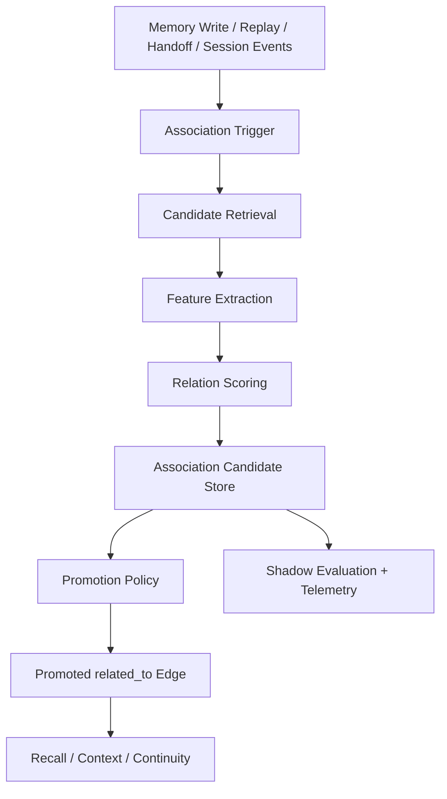

# Aionis Associative Linking for Execution Memory ADR

Date: `2026-03-16`  
Status: `proposed`

## Context

Aionis already models execution memory as durable graph objects:

- `memory node`
- `memory edge`
- `memory commit`
- layered recall and context assembly
- replay, handoff, and execution continuity on top of that substrate

It already creates some relationships automatically:

1. `topic_cluster` writes `part_of` and `derived_from`
2. `write_distillation` creates distilled evidence and fact nodes with `derived_from`
3. `compression_rollup` and `semantic_abstraction` add higher-layer nodes and supporting links
4. recall performs bounded graph expansion around top semantic seeds

That means Aionis already has a real memory graph.

What it does **not** yet have is a dedicated, general-purpose associative linking layer that can:

1. notice that newly written execution memory is related to existing execution memory
2. propose stable links automatically
3. decide which proposed links are safe enough to affect recall
4. do this without turning Aionis into a generic knowledge graph product or workflow engine

The product boundary remains fixed:

> Aionis is not a general workflow engine.  
> Aionis is an execution-state runtime for coding-agent continuity.

Any associative linking work must strengthen `Execution Memory` while preserving `Execution Control` and `Execution Continuity` as separate higher layers.

## Decision

Aionis should add an **Associative Linking Engine** as an internal enhancement inside `Execution Memory`.

The engine must be:

1. `shadow-first`
2. `coding-task-specific`
3. `scope-bounded`
4. `audit-friendly`
5. `additive to the existing graph contract`

It must **not**:

1. redefine Aionis as a generic knowledge graph platform
2. introduce arbitrary business-workflow semantics
3. force immediate public route-family changes
4. replace replay, handoff, or execution-state contracts with graph-only abstractions

The implementation recommendation is:

1. keep the current public `memory_edges` contract unchanged in phase 1
2. store associative proposals in internal candidate tables first
3. promote only high-confidence candidates into normal `related_to` edges
4. keep relation-specific meaning in sidecar metadata until a future public contract is justified

## Why This Shape

There are three plausible approaches.

### Option A: Write `related_to` edges directly on every memory write

Pros:

- lowest conceptual overhead
- fast path to a denser graph

Cons:

- risks graph pollution immediately
- no shadow mode
- no review trail for why a link exists
- harder to rollback noisy links
- raises write-path latency and operator risk

### Option B: Build a full public memory-graph relation system with many new edge types

Pros:

- semantically expressive
- externally visible from day one

Cons:

- changes canonical object contracts too early
- likely causes public API churn
- pushes Aionis toward generic knowledge graph product behavior
- increases migration and SDK cost before evidence exists

### Option C: Shadow-first associative linking pipeline

Pros:

- preserves current contracts
- lets Aionis measure link quality before promotion
- supports coding-specific heuristics without public API churn
- gives recall a path to benefit from improved connectivity gradually

Cons:

- more internal plumbing
- delayed public visibility

This ADR chooses **Option C**.

## Goals

The feature is in scope only if it improves at least one of these:

1. better recall of coding-task-relevant memory
2. better continuity across interrupted sessions
3. stronger handoff and resume packets
4. more stable reviewer-ready completion
5. lower rediscovery cost on repeated execution paths

## Non-goals

This ADR explicitly does not aim to provide:

1. a generic enterprise knowledge graph platform
2. user-authored arbitrary ontology design
3. business process mining
4. project management graph modeling
5. arbitrary non-coding associative memory as a first-class product direction

## Boundary Rules

The Associative Linking Engine belongs to `Execution Memory`.

It may influence:

1. retrieval candidate quality
2. subgraph density
3. context assembly quality
4. continuity packet quality

It must not redefine:

1. `ExecutionState`
2. `ExecutionPacket`
3. `ControlProfile`
4. replay lifecycle semantics
5. automation orchestration semantics

The mental model is:

```text
Execution Memory
  existing write/recall/context graph
  + associative linking enhancement

Execution Control
  unchanged policy, sandbox, budgets, governance

Execution Continuity
  unchanged replay/handoff/reviewer-ready contracts
  but with better memory substrate underneath
```

## Design Principles

### 1. Coding-first, not generic memory-first

Link signals should prefer coding-task evidence such as:

- file overlap
- symbol overlap
- same repository root
- same workspace
- shared validation targets
- shared failed commands
- shared reviewer concerns
- shared handoff anchors
- replay lineage overlap

General semantic similarity is allowed, but it must not dominate coding-task signals.

### 2. Shadow before promotion

All new association logic should first produce candidates, not live graph behavior.

The system should learn:

- which associations are useful
- which are noisy
- which relation kinds are safe

before those links affect default recall paths.

### 3. Preserve public edge semantics

The current public edge types are:

- `part_of`
- `related_to`
- `derived_from`

Phase 1 should not expand that list.

Associative semantics such as:

- `same_task`
- `supports`
- `contradicts`
- `extends`
- `supersedes`
- `repeats`

should live in internal metadata first, not in the public `EdgeType` enum.

### 4. Association quality beats association volume

The goal is not to maximize edge count.

The goal is to improve:

- recall precision
- recall coverage for continuity-sensitive tasks
- handoff recovery
- replay and review quality

Sparse, high-signal links are better than a dense but noisy graph.

### 5. Every promoted link needs provenance

Every promoted association should be explainable by:

1. source nodes
2. candidate features
3. relation kind
4. score and threshold
5. promotion run / commit

## Proposed Architecture



## Core Components

### 1. Association Trigger

This is the bounded producer side.

Recommended trigger sources:

1. `memory/write` for new `event`, `evidence`, `concept`, and `procedure` nodes
2. replay writes that produce new execution artifacts
3. handoff store when a handoff summary or packet is written
4. selected session-event writes on the same coding task path

Phase 1 should avoid synchronous heavy linking inside `/write`.

Instead, `/write` should enqueue an internal outbox item like:

- `event_type = associative_link`

This keeps write latency stable and lets the worker operate with retries and bounded budgets.

### 2. Candidate Retrieval

Given one source node, the engine retrieves a bounded candidate neighborhood from the same `tenant/scope`.

Candidate retrieval should combine:

1. embedding similarity
2. lexical similarity on title and summary
3. same repo root or file path anchors
4. same symbol or validation target anchors
5. same session or replay lineage anchors
6. existing shared citations or source event references

This retrieval is not a full graph search.

It is a bounded candidate-generation phase with hard caps such as:

- max candidate nodes per source
- max wall-clock budget per source
- same-scope only
- no cross-tenant linking

### 3. Feature Extraction

Each candidate pair receives structured features.

The feature set should emphasize coding-task continuity signals:

1. embedding cosine similarity
2. token overlap on normalized summaries
3. shared file path count
4. shared symbol count
5. shared command / validation target overlap
6. same handoff anchor
7. same replay playbook or run lineage
8. recency distance
9. node type pair
10. same producer / owner agent

The feature extractor must remain deterministic for the same inputs whenever possible.

### 4. Relation Scoring

The scorer maps candidate features into:

1. `relation_kind`
2. `confidence`
3. `promotion_recommendation`

Initial supported internal relation kinds should be intentionally small:

1. `same_task`
2. `supports`
3. `extends`
4. `repeats`
5. `supersedes`

`contradicts` should be delayed until evidence quality is better, because contradiction links are costly when wrong.

Phase 1 does not need a learned model.

A weighted deterministic scorer is sufficient if it is:

- coding-aware
- observable
- benchmarkable
- easy to debug

### 5. Association Candidate Store

This is the key internal addition.

Recommended new internal table:

- `memory_association_candidates`

Suggested fields:

- `id`
- `scope`
- `src_id`
- `dst_id`
- `relation_kind`
- `status` (`shadow`, `promoted`, `rejected`, `expired`)
- `score`
- `confidence`
- `feature_summary_json`
- `evidence_json`
- `source_commit_id`
- `worker_run_id`
- `promoted_edge_id`
- `created_at`
- `updated_at`

Why a separate table:

1. `memory_edges` has no metadata sidecar today
2. public edge semantics stay stable
3. candidate quality can be measured without polluting recall
4. promotion can be rolled back independently

### 6. Promotion Policy

Promotion converts selected candidates into normal graph edges.

Phase 1 rule:

1. only promote candidates with high confidence
2. only project them as `related_to`
3. keep internal relation meaning in the candidate table
4. link the candidate to the promoted edge id

This preserves the public graph while letting recall benefit from better connectivity.

For symmetric relation kinds like `same_task` and `repeats`, the projected edge should use deterministic endpoint ordering so only one canonical edge is written.

For directional kinds like `supersedes`, the candidate record should keep directionality even if recall currently treats the promoted `related_to` edge as undirected connectivity.

## Recommended Data Model Evolution

### Phase 1

Add only internal candidate storage and worker support.

No public route changes are required.

No SDK changes are required.

No `EdgeType` expansion is required.

### Phase 2

Optionally add internal edge metadata sidecar if promotion needs more explainability at recall time.

Recommended table if needed:

- `memory_edge_annotations`

Possible fields:

- `edge_id`
- `relation_kind`
- `source_candidate_id`
- `reason_json`
- `created_by`

This table should remain internal until there is a strong product reason to expose it.

### Phase 3

Only after measured benefit, consider whether public recall should optionally expose associative relation details in debug or observability surfaces.

Even then, prefer additive response fields over changing canonical edge types.

## Recall and Context Integration

The Associative Linking Engine should improve recall in three stages.

### Stage A: No recall impact

Candidates are generated and scored, but recall ignores them entirely.

Use this stage to measure:

- candidate quality
- promotion precision
- latency cost

### Stage B: Promoted-edge recall only

Recall uses only promoted `related_to` edges.

This is the safest production path because recall already understands graph expansion over `related_to`.

### Stage C: Optional association-aware ranking

Once evidence exists, recall scoring may incorporate association metadata such as:

- high-confidence `same_task`
- recent `supports`
- `supersedes` preference when multiple candidate memories compete

This should remain opt-in or profile-gated at first.

## How This Enhances Aionis Without Distorting It

This proposal does **not** change the Aionis top-level product frame.

It still remains:

1. `Execution Memory`
2. `Execution Control`
3. `Execution Continuity`

The enhancement is limited to `Execution Memory`.

What changes:

1. the memory graph becomes more automatically connected
2. recall can retrieve better execution neighborhoods
3. handoff and continuity packets can anchor into richer memory structure

What does not change:

1. replay remains the continuity primitive
2. control remains policy, sandbox, and governance
3. Aionis still does not become a generic workflow engine

The anti-drift rule is:

> If a proposed association feature does not directly improve coding-task continuity, handoff quality, replay quality, or reviewer-ready completion, it does not belong in this engine.

## Failure Modes and Mitigations

### 1. Noisy graph pollution

Risk:

- too many weak links lower recall quality

Mitigation:

- shadow-first pipeline
- promotion thresholds
- candidate expiration
- quality dashboards

### 2. Generic knowledge-graph drift

Risk:

- the system starts modeling arbitrary non-coding semantics

Mitigation:

- coding-first feature set
- admission rules tied to coding-task continuity
- no arbitrary ontology expansion in phase 1

### 3. Write-path latency regression

Risk:

- direct linking work slows `/write`

Mitigation:

- outbox trigger
- bounded async workers
- no heavy pairwise linking on synchronous routes

### 4. Recall instability

Risk:

- promoted associations distort retrieval unexpectedly

Mitigation:

- recall gated by promoted edges only
- tenant/profile-level flags
- explicit observability on link-derived recall gains

### 5. Explainability loss

Risk:

- operators cannot tell why a link appeared

Mitigation:

- candidate features stored in internal evidence JSON
- promotion audit trail
- debug surfaces before broad rollout

## Rollout Plan

### Phase 0: Contract and schema

Deliver:

1. internal ADR acceptance
2. candidate-table schema
3. outbox event contract
4. basic worker skeleton

Exit criteria:

1. no public API changes
2. no write-path regression

### Phase 1: Shadow candidate generation

Deliver:

1. candidate generation for `event`, `evidence`, and `concept`
2. deterministic scoring
3. internal metrics and samples

Exit criteria:

1. stable candidate generation on representative coding tasks
2. no cross-scope leaks
3. quality review of sampled candidates

### Phase 2: High-confidence promotion

Deliver:

1. promotion of selected candidates to `related_to`
2. recall consuming promoted edges only
3. promotion and rollback tooling

Exit criteria:

1. measurable recall or continuity improvement on benchmarked coding paths
2. no major regression in precision

### Phase 3: Continuity-aware optimization

Deliver:

1. packet/handoff/replay integrations that explicitly benefit from association metadata
2. optional association-aware ranking policies

Exit criteria:

1. measurable improvement on interruption recovery, handoff quality, or reviewer-ready completion

## Success Metrics

The engine should be judged on runtime outcomes, not graph density vanity metrics.

Primary metrics:

1. continuity resume success rate
2. handoff recovery success rate
3. reviewer-ready completion rate
4. replay rediscovery reduction
5. recall precision on coding-task benchmark slices

Secondary metrics:

1. promoted-link precision from sampled review
2. promoted-link acceptance ratio
3. noisy-link rollback rate
4. worker latency and queue depth

Avoid using these as primary KPIs:

1. total edge count
2. total candidate count
3. graph density alone

## Testing Strategy

### Unit tests

1. feature extraction determinism
2. symmetric and directional candidate normalization
3. promotion threshold logic
4. cross-scope rejection

### Integration tests

1. `/write` enqueues association trigger without latency regression
2. worker creates candidate rows correctly
3. high-confidence candidate promotion writes valid `related_to` edge
4. recall can traverse promoted edges without contract breakage

### Benchmark tests

Use continuity-sensitive coding tasks, not generic semantic retrieval sets.

Required benchmark families:

1. interrupted coding-task resume
2. handoff recovery
3. replay rediscovery reduction
4. reviewer-ready completion

## Consequences

If adopted, Aionis becomes more faithful to its original memory-graph intuition:

- each memory is a point
- points can gain automatic links
- those links can improve retrieval and continuity

But the system does so in a controlled way:

- without redefining the whole product as a graph platform
- without weakening the execution-continuity boundary
- without destabilizing the existing public memory contract

This is the recommended path for making Aionis feel more like a living execution-memory graph while staying unmistakably focused on coding-agent continuity.
