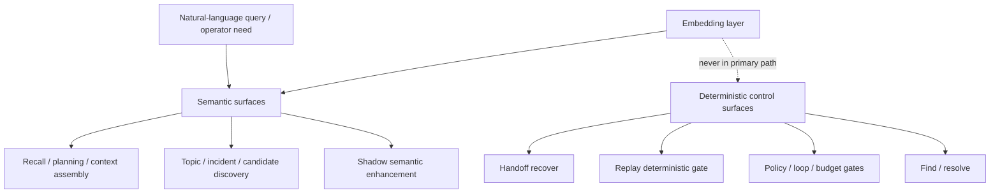

# Aionis Embedding Enablement ADR

Last updated: `2026-03-14`  
Status: `proposed internal ADR`

## 1. Executive Summary

This document answers one architecture question:

1. Where should embedding be enabled in Aionis, and where should it remain explicitly out of the critical path?

Short answer:

1. **Embedding should not be globally enabled as a platform assumption.**
2. **Embedding should be enabled by surface, not by product-wide default.**
3. **Embedding belongs in semantic recall, semantic discovery, and shadow semantic enhancement paths.**
4. **Embedding must not become a dependency for deterministic control surfaces.**
5. **Aionis should preserve a hard boundary between semantic assistance and deterministic execution control.**

The core architecture conclusion is:

> Embedding in Aionis should be an opt-in semantic acceleration layer, not a kernel-wide dependency.

The operating rule is:

> Use embedding where semantic similarity improves recall or discovery. Do not use embedding where correctness depends on exact identity, exact policy, exact budgets, or deterministic replay semantics.

## 2. Context

### 2.1 The Real Decision Is Not "Embedding On Or Off"

The real decision is not whether Aionis "supports embeddings."

It already does.

The real architecture question is:

1. which runtime surfaces should depend on embedding
2. which surfaces should only be improved by embedding
3. which surfaces should remain fully deterministic even if semantic infrastructure exists

That distinction matters because Aionis is not a vector-memory plugin.

It is a system that combines:

1. memory recall
2. planner context assembly
3. handoff recovery
4. replay reuse
5. policy and governance
6. auditability and incident workflows

These surfaces do not all have the same correctness requirements.

### 2.2 Current Code Boundary

The current codebase already shows three different behavior classes:

1. **semantic recall paths**
   - stage-1 recall candidate retrieval is ANN/vector based
2. **deterministic retrieval and recovery paths**
   - `find`
   - `resolve`
   - handoff recovery by explicit anchor and filters
3. **deterministic governance and replay paths**
   - replay deterministic gate
   - execution loop gate
   - policy drift and feedback thresholds

This means the repository already contains the correct architectural instinct:

1. semantic retrieval is useful
2. deterministic control still matters
3. these concerns should not be collapsed into one mechanism

## 3. Requirements And Constraints

The decision must satisfy both functional and non-functional constraints.

### 3.1 Functional Requirements

Embedding should improve:

1. recall quality for natural-language queries
2. discovery of semantically related prior work
3. discovery of similar incidents, topics, or episodes
4. context assembly quality under bounded budgets

Embedding must not weaken:

1. exact handoff recovery
2. deterministic replay eligibility
3. hard governance checks
4. explicit budget and timeout enforcement
5. exact audit and provenance chains

### 3.2 Non-Functional Requirements

The architecture must preserve:

1. deterministic failure semantics on critical paths
2. explainable operator behavior
3. bounded latency and bounded cost
4. backward compatibility with deterministic-only deployments
5. progressive adoption from local evaluation to production

### 3.3 Operational Constraints

Embedding introduces real operational cost:

1. provider configuration
2. provider rate limiting
3. queueing and backfill pressure
4. missing-vector and stale-vector states
5. model-version drift

That means embedding cannot be treated as "free infrastructure."

## 4. Decision

### 4.1 Primary Decision

Aionis should adopt the following rule:

1. **default-off as a global dependency**
2. **opt-in by runtime surface**
3. **allowed in semantic recall and discovery**
4. **allowed in shadow semantic enhancement**
5. **forbidden in deterministic control surfaces**

This is a layered enablement model, not a binary product setting.

### 4.2 Surface Classification

#### Class A: Core Semantic Surfaces

Embedding should be enabled here when semantic quality matters:

1. `recall_text`
2. `planning/context`
3. `context/assemble`
4. topic clustering and similar structural grouping
5. similar-incident lookup
6. replay candidate discovery, if introduced as a recommendation surface

These are the places where semantic similarity is the actual job.

#### Class B: Semantic Enhancement Surfaces

Embedding may be used here, but only as an additive enhancement:

1. handoff enrichment
2. L4 semantic abstraction
3. replay learning summaries or operator-assistive triage
4. related-history recommendations during incident review

These paths may use embedding for better ranking, summarization, or correlation, but the underlying canonical object resolution must remain deterministic.

#### Class C: Deterministic Control Surfaces

Embedding must not be placed in the decision path here:

1. hard loop control
2. hard policy gate
3. budget or timeout enforcement
4. deterministic replay gate
5. exact handoff recovery
6. explicit `find` and `resolve` recovery paths

These surfaces require exactness, not semantic approximation.

## 5. Architecture Model

The architecture implication is simple:

1. embedding is an input to ranking, discovery, and semantic summarization
2. embedding is not an authority for hard correctness decisions

## 6. Why This Decision Fits The Current Codebase

### 6.1 Recall Already Uses Semantic Retrieval

Current recall stage-1 candidate selection is already vector-based and filtered through visibility and state constraints.

That means Aionis already treats embedding as appropriate for recall.

This should continue.

### 6.2 Handoff Recovery Is Already Deterministic

Current handoff recovery is not semantic search.

It resolves handoffs through explicit filters such as:

1. `anchor`
2. `handoff_kind`
3. `repo_root`
4. `file_path`
5. `symbol`

That is the correct design because handoff is a continuity contract, not an approximate recommendation.

Embedding may help suggest related handoffs, but should not replace primary recovery.

### 6.3 Replay Eligibility Is Already Deterministic

Current replay deterministic gating is based on:

1. playbook status
2. matcher fingerprint equality
3. policy constraint fingerprint equality

This is exactly the kind of surface that must not become semantic.

Embedding may help find possible reuse candidates before gate evaluation, but it must not influence the actual deterministic eligibility check.

### 6.4 Drift Detection Is Currently Statistical, Not Semantic

Current execution-loop drift checks are based on:

1. feedback volume
2. negative ratio
3. active rule coverage
4. cross-tenant spread

This is also correct.

"Similar drift patterns" may be useful for operator investigation, but the actual drift gate should remain metric- and threshold-driven.

## 7. Allowed And Forbidden Uses

### 7.1 Allowed Uses

Embedding is allowed for:

1. semantic recall candidate generation
2. semantic ranking before bounded graph expansion
3. topic clustering
4. similar incident retrieval
5. replay reuse recommendation
6. semantic operator-assistive workflows
7. shadow-only higher-layer memory abstractions

### 7.2 Forbidden Uses

Embedding is forbidden for:

1. approving replay strict mode
2. rejecting or allowing policy execution
3. budget and timeout admission
4. exact handoff recovery
5. exact object recovery when explicit identifiers exist
6. replacing fingerprint equality with "close enough" similarity

## 8. Consequences

### 8.1 Positive

1. preserves clear correctness boundaries
2. allows semantic gains where they matter most
3. keeps deterministic-only deployments viable
4. reduces blast radius from provider outages or embedding drift
5. makes incidents easier to debug because critical gates stay explainable

### 8.2 Negative

1. system behavior becomes intentionally heterogeneous across surfaces
2. more explicit capability classification is required in docs and code review
3. some teams may initially want a simpler "all on" switch
4. candidate discovery and deterministic eligibility remain two separate steps

### 8.3 Neutral

1. embedding remains important infrastructure, but no longer defines the whole product
2. some features will legitimately work well without embeddings
3. operator mental models become more nuanced, but also more accurate

## 9. Alternatives Considered

### 9.1 Alternative A: Global Embedding-On Architecture

Rejected.

This would simplify one part of the product story, but it would create the wrong runtime behavior:

1. hard paths would inherit semantic nondeterminism
2. provider failures would impact too many surfaces
3. exact replay and governance semantics would weaken

This is not consistent with Aionis's audit and replay positioning.

### 9.2 Alternative B: Embedding Only In Recall And Nowhere Else

Partially rejected.

This is safer than global enablement, but too narrow.

Aionis should also use embedding for:

1. discovery surfaces
2. topic grouping
3. similar incident lookup
4. bounded shadow semantic assistance

The system would otherwise leave useful semantic value on the table.

### 9.3 Alternative C: No Embedding Dependency At All

Rejected as a universal architecture stance.

It is true that Aionis can start without embedding.

But once semantic retrieval quality matters, refusing embedding entirely would cripple:

1. recall quality
2. semantic clustering
3. similar-history discovery
4. practical context assembly quality

The right answer is selective enablement, not semantic abstinence.

## 10. Rollout Recommendation

### Phase 1

Treat embedding as supported only for:

1. `recall_text`
2. `planning/context`
3. `context/assemble`
4. topic clustering

### Phase 2

Add embedding-backed recommendation surfaces for:

1. similar incidents
2. replay candidate discovery
3. related continuity artifacts

These must remain recommendation surfaces, not hard gates.

### Phase 3

Expand shadow semantic layers carefully:

1. L4 semantic abstraction
2. semantic incident summaries
3. replay learning assistance

These should remain traceable to L3 or L0 trust anchors.

## 11. Review Checklist For Future Changes

When a PR introduces embedding into a new surface, reviewers should ask:

1. Is this surface semantic discovery, or deterministic control?
2. If embedding fails, does the surface degrade gracefully?
3. If vectors drift, do correctness guarantees change?
4. Can an operator explain why the system made this choice?
5. Is there still an exact identifier path for audit and recovery?
6. Are trust-anchor layers preserved even if semantic layers are enabled?

If the answer to any of the following is "yes", the change should be rejected or redesigned:

1. embedding can directly approve strict replay
2. embedding can directly approve policy execution
3. embedding can directly alter budget admission
4. embedding can replace exact handoff identity

## 12. Final Position

The correct Aionis position is:

1. **embedding is valuable**
2. **embedding is not universal**
3. **embedding should be layered**
4. **deterministic control surfaces stay deterministic**

In practical terms:

> Aionis should enable embedding for recall and discovery, allow it for shadow semantic enhancement, and forbid it from becoming a dependency of replay gates, handoff recovery, policy gates, or hard budget control.

## 13. References

Implementation evidence in the current repository:

1. `src/store/recall-access.ts`
2. `src/memory/layer-policy.ts`
3. `src/memory/handoff.ts`
4. `src/memory/replay.ts`
5. `src/jobs/execution-loop-gate.ts`
6. `src/jobs/topicClusterLib.ts`
7. `src/jobs/README.md`
8. `docs-site/docs/reference/faq.md`
9. `docs-site/docs/reference/configuration.md`
