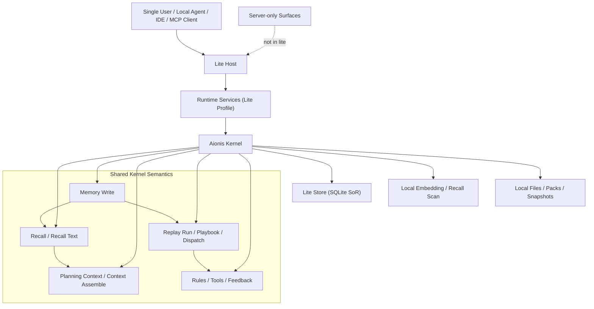
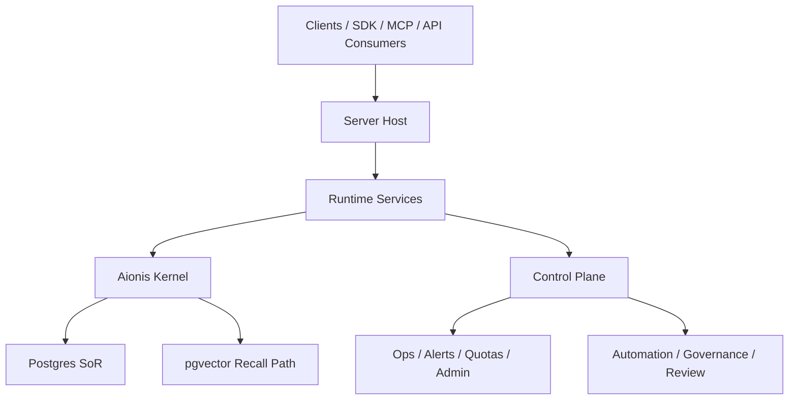
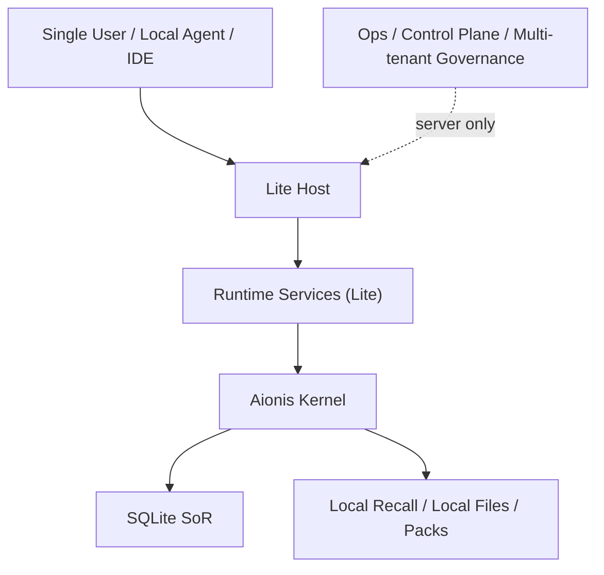

# Aionis Lite vs Server Architecture Analysis

Last updated: `2026-03-11`  
Status: `internal analysis`

## 1. Executive Summary

This document answers four product and architecture questions:

1. What the overall architecture looks like after Aionis Lite is completed.
2. Whether the current database stack still remains valid.
3. Who the full server edition is for.
4. Who the Lite edition is for.

Short answer:

1. **Lite should be a real edition, not a fork and not a feature-removed demo.**
2. **Server should continue to use Postgres + pgvector as the production scale path.**
3. **Lite should move to SQLite as its local system of record.**
4. **The current `embedded` backend should not become the official Lite backend.**
5. **Server and Lite should share one kernel, but differ in topology, persistence backend, and outer-layer capability set.**

The most important framing is this:

> Aionis Lite should be the same kernel in a smaller topology, not a different product with a similar name.

That means the split is not:

- server = complete Aionis
- lite = Aionis with core semantics removed

The split should be:

- server = full topology for production and teams
- lite = local single-user topology with the same kernel semantics

## 2. The Product Split

### 2.1 Aionis Server

Server is the production-grade edition.

Its defining characteristics are:

1. multi-user or team-facing deployment
2. production operations
3. governance-heavy runtime surfaces
4. stronger scalability path
5. operational control and policy surfaces

Server is where Aionis expresses:

1. control plane
2. quotas and policy enforcement
3. audit and alerting
4. automation orchestration
5. remote and operational topology

### 2.2 Aionis Lite

Lite should be the local-first edition.

Its defining characteristics are:

1. single user
2. single process
3. local machine
4. one local primary database file
5. low operational burden

Lite is not supposed to compete with Server on governance or multi-tenant operations.

Lite is supposed to maximize:

1. developer adoption
2. local execution memory
3. local replay and playbook accumulation
4. low setup friction
5. later promotion to Server

## 3. What Lite Architecture Should Look Like After It Is Done

### 3.1 High-Level Shape

The end-state architecture should look like this:

This means Lite should still have:

1. kernel
2. runtime host
3. local persistence
4. replay
5. packs and upgrade bridge

But Lite should not have to carry:

1. control plane
2. team governance
3. multi-tenant quota system
4. ops dashboards
5. automation orchestration in phase 1

### 3.2 Layering

The correct layering should still be:

1. `Kernel`
2. `Runtime Services`
3. `Control & Extensions`

But in Lite, the third layer is much smaller.

That means:

- the kernel stays mostly the same
- runtime services become local-profiled
- control/extensions are either absent or explicitly rejected

### 3.3 What Should Remain the Same

If Lite is done correctly, these things should remain semantically identical between Lite and Server:

1. node and edge identity rules
2. commit-chain semantics
3. URI semantics
4. pack export/import shape
5. replay run and playbook semantics
6. context assembly semantics
7. deterministic replay dispatch semantics

This is the core reason Lite should be treated as an edition, not a fork.

### 3.4 What Should Differ

These things should differ between Lite and Server:

1. deployment topology
2. persistence backend
3. capability availability
4. operational assumptions
5. concurrency envelope
6. scale target

That is a healthy edition split.

## 4. Will the Existing Database Combination Still Be Used?

### 4.1 Yes, for Server

The existing production-oriented database path should still remain the mainline for Server.

That means:

1. **Postgres remains the primary server SoR**
2. **pgvector remains the production recall/vector path**
3. the current production-oriented runtime assumptions continue to live in Server

This is not a temporary compromise. It is the correct full-edition architecture.

Why it should stay:

1. transactional graph persistence already fits the commit-chain model
2. current recall and replay implementation still have strong Postgres shape
3. governance and multi-tenant surfaces align better with a server database system
4. Server needs a clearer path for scale, ops, and operational tooling

### 4.2 No, for Official Lite

The existing database combination should **not** be reused as the official Lite backend.

Specifically:

- Lite should not require Docker
- Lite should not require external Postgres
- Lite should not define itself as “embedded mode on top of Postgres”

The current `embedded` backend is still:

1. db-backed
2. `postgres_delegated`
3. coupled to the current SQL-shaped write/replay flow

So it is not the right end-state for Lite.

### 4.3 What the Final Storage Split Should Be

The clean split should be:

| Edition | Primary SoR | Recall strategy | Official stance |
|---|---|---|---|
| Server | Postgres | pgvector + current bounded graph recall | long-term production path |
| Lite | SQLite | application-layer vector distance scan first, optional local extension later | long-term local path |
| Current embedded experimental path | Postgres-delegated + snapshot runtime | mixed / compatibility-oriented | transitional or experimental only |

### 4.4 What Happens to the Current Embedded Path

The current embedded runtime should likely remain, but not as the public Lite definition.

It can still be useful for:

1. testing
2. parity experiments
3. snapshot/export behavior
4. local dev profiles
5. migration or compatibility harnesses

But product-wise, it should not be the thing users install and call “Aionis Lite”.

That would confuse:

1. architecture
2. product messaging
3. support expectations
4. long-term maintenance

## 5. What the Full Server Architecture Should Mean

The completed Server architecture should look like this:

In plain terms:

Server is the edition where Aionis is fully operated as a production runtime platform.

Its job is not only to remember and replay.
Its job is to do those things under:

1. policy
2. audit
3. quotas
4. control surfaces
5. operational discipline

## 6. What the Lite Architecture Should Mean

The completed Lite architecture should look like this:

In plain terms:

Lite is the edition where Aionis behaves like a local execution-memory kernel on one machine.

Its job is to:

1. preserve kernel identity
2. keep replay and packs first-class
3. make local use easy
4. make later migration to Server clean

Its job is not to be:

1. a mini control plane
2. a team orchestration platform
3. a fake production environment

## 7. Who the Full Version Is For

### 7.1 Best-Fit Users

The full Server edition is best for:

1. teams building agent products
2. infra/platform teams
3. companies that need auditability and governance
4. users with production traffic or production agents
5. users who need controlled rollout and operational surfaces

### 7.2 Real Scenarios

Server is the right choice when the user says things like:

1. “We need tenant isolation.”
2. “We need admin controls and quotas.”
3. “We need replay, review, and governance in production.”
4. “We need to operate this for a team, not one person.”
5. “We need an actual production memory/runtime platform.”

### 7.3 Why They Need Server

These users do not only need memory.
They need:

1. operating model
2. governance model
3. production persistence and scale path
4. control surfaces
5. reliability discipline

Lite is too small for that.

## 8. Who Lite Is For

### 8.1 Best-Fit Users

Lite is best for:

1. individual developers
2. agent builders prototyping locally
3. solo founders
4. power users who want local execution memory
5. teams doing local-first experimentation before moving to Server

### 8.2 Real Scenarios

Lite is the right choice when the user says things like:

1. “I want Aionis on my laptop.”
2. “I do not want Docker and managed Postgres just to start.”
3. “I want local replay, local memory, local packs.”
4. “I am one developer, not an ops team.”
5. “I want to start simple, then promote to production later.”

### 8.3 Why They Need Lite

These users do not need governance-heavy topology.
They need:

1. low setup friction
2. local speed
3. one-machine persistence
4. same kernel semantics
5. upgrade path later

That is exactly what Lite should optimize for.

## 9. The Core Product Decision

The most important product decision is this:

> Lite and Server should not be differentiated by “which one is the real Aionis”.

They should be differentiated by:

1. topology
2. operations
3. target user
4. persistence backend
5. control surface scope

This is the healthiest split because it avoids two failure modes.

### Failure Mode A: Lite Becomes Fake Aionis

This happens if Lite loses:

1. replay
2. commit-chain
3. packs
4. context assembly
5. deterministic replay dispatch

Then it becomes a demo memory product, not Aionis.

### Failure Mode B: Lite Becomes a Broken Server

This happens if Lite tries to keep:

1. control plane
2. governance-heavy surfaces
3. multi-tenant assumptions
4. external database dependency
5. operational topology

Then it becomes a bad deployment experience, not a clean local edition.

The correct Lite version sits in the middle:

- same kernel truth
- smaller outer shell

## 10. Recommended Final Positioning

If Lite is completed successfully, the clean product positioning should be:

### Aionis Server

**A production agent runtime kernel with governance, replay, control, and team-grade operational surfaces.**

### Aionis Lite

**A local single-user edition of the same runtime kernel, optimized for low-friction execution memory, replay, and later promotion to Server.**

## 11. Final Recommendation

If you are asking whether Lite is worth doing, the answer is yes.

But only if the edition split is kept clean:

1. **Server keeps Postgres + pgvector as the main production path**
2. **Lite uses SQLite as the official local SoR**
3. **The current embedded backend does not become the product definition of Lite**
4. **Kernel semantics remain shared**
5. **Control plane and enterprise governance remain Server-first**

That gives Aionis a coherent product ladder:

1. start local with Lite
2. keep the same kernel semantics
3. promote memory/playbooks/packs upward
4. move to Server when governance and operations matter

That is a much stronger strategy than either:

1. forcing everyone onto Server too early
2. shipping a watered-down “Lite” that is no longer recognizably Aionis

## 12. Bottom-Line Answer

Your intuition is correct.

The right end-state is not:

- one edition replacing the other

The right end-state is:

- **Server = production topology**
- **Lite = local topology**
- **same kernel, different outer system**

And yes, the old database combination still has a place:

- **it should stay as the Server architecture**
- **it should not be the official Lite architecture**
