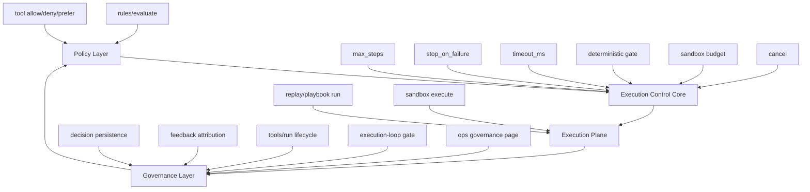

# Aionis Loop Control Capability Definition (Internal)

Status: `draft` (`2026-03-14`)

Primary reference:

1. [/Users/lucio/Desktop/Aionis/docs/plans/2026-03-14-loop-control-audit.md](/Users/lucio/Desktop/Aionis/docs/plans/2026-03-14-loop-control-audit.md)

## Goal

Define a coherent internal capability boundary for what the team may call `Loop Control` during architecture and roadmap work, without pretending that the current product already exposes a single feature by that name.

This document answers:

1. what the capability is
2. what is inside and outside the boundary
3. how existing subsystems map into it
4. what gaps remain before it becomes a productized capability
5. what roadmap should close those gaps

---

## Decision

Internal recommendation:

Treat `Loop Control` as a **planning umbrella**, not as a current public feature name.

Canonical internal definition:

> Aionis Loop Control is the combined capability that bounds execution, constrains tool and step progression, and preserves end-to-end traceability and feedback across policy, replay, sandbox, and governance surfaces.

That umbrella contains two sub-capabilities:

1. **Execution Control Core**
2. **Closed-Loop Governance Layer**

This split is necessary because the repository already implements both, but they are not currently packaged as one user-facing feature.

---

## Capability Boundary

### 1. Execution Control Core

This is the hard-control layer.

It includes controls that directly affect whether execution continues:

1. replay `max_steps`
2. replay `stop_on_failure`
3. replay and sandbox `timeout_ms`
4. deterministic replay gate
5. sandbox budget gate
6. sandbox cancel
7. command allowlists and execution backend restrictions

This layer is responsible for:

1. bounding a run
2. deciding when to stop
3. deciding when not to start
4. deciding whether execution may continue after failure

### 2. Closed-Loop Governance Layer

This is the traceability and learning layer.

It includes:

1. rules evaluation
2. tool policy explainability
3. persisted decision records
4. tool outcome feedback attribution
5. run lifecycle readback
6. execution-loop gate
7. admin diagnostics and ops views

This layer is responsible for:

1. proving why behavior changed
2. linking outcomes back to decisions and rules
3. making execution reviewable and governable
4. supplying thresholds for promotion, rollback, and operator action

### Out Of Scope

The capability does **not** include:

1. general memory retrieval quality
2. general recall ranking
3. vector search tuning
4. all automation orchestration semantics
5. every ops or admin feature in Aionis

Those can feed into loop-control quality, but they are not the capability itself.

---

## Architecture Model

### Layer Responsibilities

#### Policy Layer

Interprets memory-derived rules and computes allowed or preferred behavior.

Current components:

1. `src/memory/rules-evaluate.ts`
2. `src/memory/tool-policy.ts`
3. `src/memory/tool-selector.ts`
4. `src/memory/tools-select.ts`

#### Execution Control Core

Applies the hard boundaries that make execution bounded and governable.

Current components:

1. `src/memory/schemas.ts`
2. `src/memory/replay.ts`
3. `src/memory/sandbox.ts`
4. `src/app/sandbox-budget.ts`

#### Execution Plane

Actually runs steps, commands, and tool actions.

Current components:

1. replay playbook execution path in `src/memory/replay.ts`
2. sandbox execution path in `src/memory/sandbox.ts`

#### Governance Layer

Captures evidence, lifecycle state, and operator-facing health.

Current components:

1. `src/memory/tools-decision.ts`
2. `src/memory/tools-run.ts`
3. `src/memory/tools-feedback.ts`
4. `src/jobs/execution-loop-gate.ts`
5. `src/routes/admin-control-dashboard.ts`
6. `apps/ops/app/governance/page.jsx`

---

## Current State Mapping

### What Already Exists

The capability is already partially implemented through distributed subsystems.

Strong existing assets:

1. bounded replay execution exists today
2. execution fail-fast exists today
3. deterministic pre-execution gating exists today
4. sandbox budget and cancel controls exist today
5. policy-driven tool routing and feedback attribution exist today
6. governance gates and diagnostics exist today

### What Is Missing

What does **not** yet exist is a unifying capability surface.

Missing pieces:

1. a canonical internal capability contract
2. one documented taxonomy tying policy, replay, sandbox, and governance together
3. one operator/API surface that says "this is execution control"
4. one SDK abstraction for bounded execution control
5. one product narrative with clear boundaries
6. one evidence pack specifically for loop-control claims

### Result

Today the capability is:

1. technically real
2. architecturally distributed
3. operationally inspectable
4. product-wise unbundled

That is the correct maturity label.

---

## Proposed Internal Capability Shape

### Capability Name

Recommended internal name:

**Loop Control Capability**

Recommended technical alias:

**Execution Control and Closed-Loop Governance**

Naming rule:

1. use `Loop Control Capability` in internal roadmap and architecture docs
2. use `Execution Control and Closed-Loop Governance` when precision matters
3. do not assume the public product will use `Loop Control` as the final label

### Capability Contract

Internally, the capability should be considered complete only when it exposes all of the following:

1. bounded execution inputs
2. deterministic and budget gating
3. explicit failure-stop semantics
4. cancellation semantics
5. persisted decision and run evidence
6. feedback attribution
7. operator-facing health and thresholding

### Minimum Contract Fields

If a formal contract is later added, it should normalize at least:

1. `max_steps`
2. `timeout_ms`
3. `stop_on_failure`
4. `gate_status`
5. `budget_status`
6. `cancel_supported`
7. `decision_trace_supported`
8. `feedback_link_supported`
9. `run_summary`
10. `governance_status`

---

## Productization Gaps

### Gap 1: Surface Fragmentation

The same capability is split across:

1. tool APIs
2. replay APIs
3. sandbox APIs
4. jobs
5. diagnostics
6. docs

This makes architectural sense, but product sense is weak.

### Gap 2: Naming Fragmentation

Current repository language includes:

1. policy loop
2. execution loop gate
3. replay
4. sandbox budget
5. tools feedback

These are all valid local names, but there is no umbrella noun.

### Gap 3: Contract Fragmentation

The bounded-execution semantics are not described as one capability contract.

Current state:

1. `max_steps` lives in replay schemas
2. timeout control appears in replay and sandbox separately
3. budget control appears in sandbox only
4. lifecycle readback appears in tools path
5. governance thresholds live in separate jobs and dashboards

### Gap 4: SDK/Product Packaging

There is no single SDK or API object that says:

1. "run this under bounded execution"
2. "tell me which boundaries were applied"
3. "tell me whether the run stayed within policy"

That is a productization gap, not a core-implementation gap.

---

## Roadmap

### Phase 0: Name and Document The Capability

Objective:

Create one internal source of truth.

Deliverables:

1. this capability definition
2. audit document cross-linking
3. terminology decision for internal use

Exit criteria:

1. architecture and product teams use the same boundary language

### Phase 1: Normalize Capability Taxonomy

Objective:

Make all relevant docs and internal artifacts talk about one capability in one way.

Deliverables:

1. internal taxonomy page for:
   - execution control core
   - governance layer
2. docs references from replay, sandbox, and execution-loop gate
3. shared evidence checklist for loop-control claims

Exit criteria:

1. all relevant internal docs map into the same capability tree

### Phase 2: Introduce Capability Contract

Objective:

Turn the current distributed controls into a coherent contract.

Deliverables:

1. normalized run summary model
2. normalized gate/budget/failure-stop metadata model
3. unified capability exposure in SDK/API docs
4. test coverage that verifies contract behavior

Exit criteria:

1. one run contract can prove bounded execution properties across replay and sandbox

### Phase 3: Unify Operator Surface

Objective:

Make operators consume one control story instead of several partial stories.

Deliverables:

1. governance page sections explicitly grouped under loop-control capability
2. execution-loop gate aligned to the same capability terminology
3. operator runbook section for bounded execution incidents

Exit criteria:

1. operators can answer "what bounded this run?" from one control surface

### Phase 4: Productization Readiness

Objective:

Decide whether this becomes a public named capability.

Decision gate:

Only move forward if:

1. naming is stable
2. capability contract is coherent
3. run evidence is exportable
4. public claims can be defended with benchmarks and docs

If not, keep the capability internal and speak publicly in narrower terms such as replay bounds, sandbox gates, and policy governance.

---

## Acceptance Criteria

Internally, the capability is mature enough when:

1. architecture can describe it as one capability with two layers
2. product can reference one internal capability boundary
3. run evidence can prove bounded execution behavior
4. governance can show decision trace and feedback link coverage
5. replay and sandbox can both report which controls were applied
6. operator tooling can explain why a run stopped, failed, or was rejected

---

## Non-Goals

This capability definition does not propose:

1. renaming all current APIs
2. collapsing replay and sandbox into one subsystem
3. replacing policy loop terminology
4. claiming that automation orchestration equals loop control
5. creating a marketing name immediately

---

## Recommendation

Internal recommendation:

1. adopt `Loop Control Capability` as the umbrella planning term
2. define it as `Execution Control Core + Closed-Loop Governance Layer`
3. do not yet expose it as a standalone public feature name
4. productize the contract before productizing the label

That is the cleanest way to convert the current distributed implementation into a roadmap-worthy capability without overstating what already exists.
