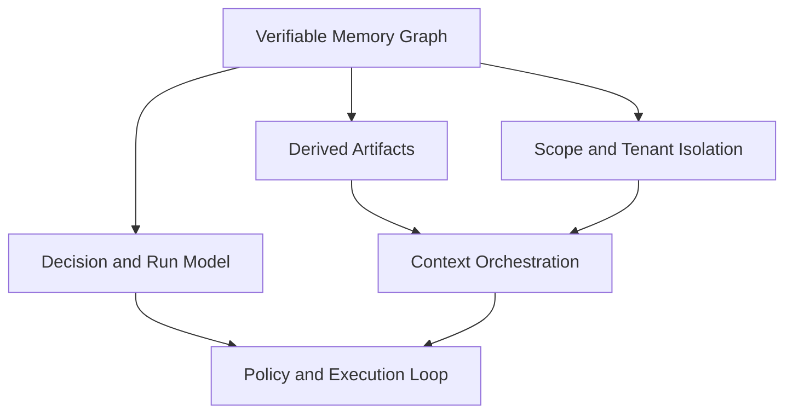

# Core Concepts

This section defines the core model behind Aionis as a production memory kernel.

## Mental Model

Aionis combines four ideas:

1. Verifiable memory state.
2. Derived async processing.
3. Tenant/scope isolation.
4. Decision-level execution provenance.

## Concept Map

1. [Verifiable Memory Graph](/public/en/core-concepts/01-verifiable-memory-graph)
2. [Derived Artifacts](/public/en/core-concepts/02-derived-artifacts)
3. [Scope and Tenant Isolation](/public/en/core-concepts/03-scope-and-tenant)
4. [Decision and Run Model](/public/en/core-concepts/04-decision-and-run-model)

## Key Terms

1. `commit`: immutable write anchor for state lineage.
2. `decision`: policy/planner decision object linked to execution.
3. `run`: one execution chain instance.
4. `scope`: logical memory partition inside a tenant.
5. `context layer`: typed section of assembled planner context.

## Read Order

1. Read all four concept pages in sequence.
2. Continue with [Architecture](/public/en/architecture/01-architecture).
3. Continue with [Context Orchestration](/public/en/context-orchestration/00-context-orchestration).
