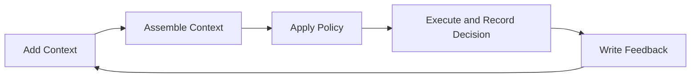

# Build Memory

This guide maps real product tasks to Aionis memory and policy APIs.

## Build Workflow

## 1) Add Context

Goal: persist new memory signals with verifiable lineage.

Primary endpoints:

1. `POST /v1/memory/write`
2. `POST /v1/memory/sessions`
3. `POST /v1/memory/events`

Recommended write payload pattern:

1. include `tenant_id` and `scope`
2. include clear `input_text`
3. include structured node metadata when available

Success criteria:

1. response includes `commit_id` and `commit_uri`
2. written memory can be found by recall or find

## 2) Assemble Context

Goal: produce LLM-ready context for planning and generation.

Primary endpoints:

1. `POST /v1/memory/recall`
2. `POST /v1/memory/recall_text`
3. `POST /v1/memory/context/assemble`
4. `POST /v1/memory/planning/context`

When to use what:

1. `recall_text`: fastest path for prompt-ready context.
2. `context/assemble`: layered and budget-controlled context.
3. `planning/context`: one-call recall + policy context surface.

## 3) Customize Context

Goal: tune quality, latency, and cost.

Main knobs:

1. `context_layers.enabled`
2. `char_budget_total`
3. `char_budget_by_layer`
4. `max_items_by_layer`
5. `include_merge_trace`

Practical tuning sequence:

1. start with `Balanced` preset
2. measure latency and answer quality
3. tighten budgets for high-traffic paths
4. keep policy-relevant layers visible for tool routing

## 4) Work with Graph Objects

Goal: inspect and reuse memory graph objects directly.

Primary endpoints:

1. `POST /v1/memory/find`
2. `POST /v1/memory/resolve`

Use cases:

1. inspect object lineage by URI
2. validate write results in operator workflows
3. replay incident chains from decision/commit anchors

## 5) Connect Memory to Execution

Goal: make memory affect behavior in a controlled way.

Policy endpoints:

1. `POST /v1/memory/rules/evaluate`
2. `POST /v1/memory/tools/select`
3. `POST /v1/memory/tools/decision`
4. `POST /v1/memory/tools/feedback`

Recommended integration:

1. call recall/context first
2. evaluate rules before tool selection
3. persist decisions and feedback per run

## Implementation Checklist

1. Scope strategy defined (`tenant_id`, `scope`).
2. Core write/recall path passing in staging.
3. Context assembly preset selected and measured.
4. Policy loop wired for at least one critical workflow.
5. Required IDs persisted in telemetry (`request_id/run_id/decision_id/commit_uri`).

## Related

1. [Get Started](/public/en/getting-started/01-get-started)
2. [Context Orchestration](/public/en/context-orchestration/00-context-orchestration)
3. [API Contract](/public/en/api/01-api-contract)
4. [API Reference](/public/en/api-reference/00-api-reference)
5. [Policy and Execution Loop](/public/en/policy-execution/00-policy-execution-loop)
