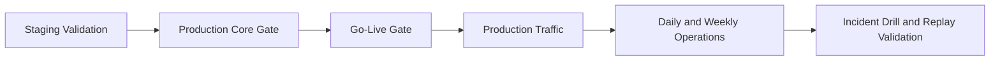

# Operate and Production

This section defines how to run Aionis reliably in production environments.

## Operating Model

Aionis production operations are built around three layers:

1. `Readiness gates`: release-go/no-go checks.
2. `Runtime controls`: health, consistency, and diagnostics.
3. `Failure drills`: repeatable incident and recovery procedures.

## Production Path

## Readiness Gates

| Gate | Purpose | Output |
| --- | --- | --- |
| Production Core Gate | blocking production-release gate | gate summary and evidence artifacts |
| Production Go-Live Gate | release checklist and publish readiness | release decision package |
| Weekly Evidence Pack | benchmark + governance continuity | weekly evidence artifacts |

## Runtime Operations

| Area | What to Watch | Why |
| --- | --- | --- |
| Health | service readiness and core checks | detect degraded runtime quickly |
| Consistency | scope/tenant integrity signals | prevent isolation regressions |
| Policy loop quality | decision-link and feedback-link coverage | keep behavior controllable |
| Performance | recall/write latency and error rates | protect user-facing reliability |

## Recommended Cadence

### Daily

1. Run production core checks on current deployment.
2. Review health, consistency, and error-rate signals.
3. Validate one replay chain from recent traffic.

### Weekly

1. Run governance and evidence snapshots.
2. Review benchmark drift against previous reports.
3. Confirm rollback path and failure drill readiness.

## Deployment Profiles

1. Standalone profile for local validation and low-risk environments.
2. Service profile for production baseline operation.
3. HA profile for high-availability and scale-oriented deployments.

Use the same gate surface across all profiles before promotion.

## Incident Readiness

1. Preserve `request_id`, `run_id`, `decision_id`, and `commit_uri` in logs.
2. Use URI resolver workflows for incident reconstruction.
3. Keep drill templates and sample runs current with production topology.

## Entry Points

1. [Production Core Gate](/public/en/operations/03-production-core-gate)
2. [Production Go-Live Gate](/public/en/operations/04-prod-go-live-gate)
3. [Operator Runbook](/public/en/operations/02-operator-runbook)
4. [Operate Overview](/public/en/operations/00-operate)
5. [Standalone to HA Runbook](/public/en/operations/06-standalone-to-ha-runbook)
6. [HA Failure Drill Template](/public/en/operations/07-ha-failure-drill-template)
7. [HA Failure Drill Sample](/public/en/operations/08-ha-failure-drill-sample)
