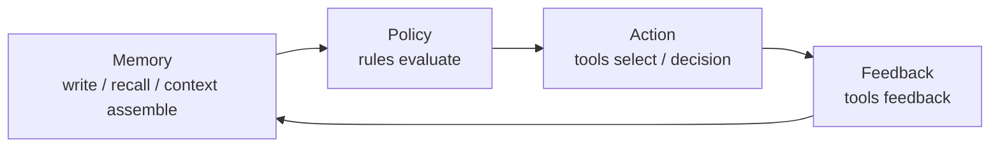

# Overview

Aionis is a `Memory Kernel` for production agent systems.

It provides a verifiable memory foundation that turns retrieval into governed execution.

## What Aionis Does

1. Stores memory as durable graph objects with commit lineage.
2. Assembles planner-ready context with explicit layer and budget controls.
3. Applies policy at decision time (`rules/evaluate`, `tools/select`).
4. Records decision and feedback traces for replay and audits.
5. Supports production operations with gates, runbooks, and benchmark artifacts.

## Why Teams Choose Aionis

1. `Verifiable state`: write lineage is explicit (`commit_id`, `commit_uri`, hash chain).
2. `Controlled execution`: memory and policy are connected, not isolated.
3. `Replayability`: requests, runs, decisions, and commits are traceable.
4. `Operational readiness`: production gate workflows are part of the product surface.
5. `Structured context`: layered context orchestration keeps quality/cost tradeoffs explicit.

## Core Loop

## Category Position

Aionis is not:

1. A plain vector store.
2. A context-loader-only utility.
3. A workflow shell without memory governance.

Aionis is:

1. A memory kernel with execution impact.
2. A policy-aware runtime substrate.
3. A production operations surface for agent memory behavior.

## Typical Production Use Cases

1. Agent support systems with long-lived customer context.
2. Multi-step copilots that require stable tool routing.
3. Workflow agents with strict audit and replay requirements.
4. Teams operating multi-tenant agent platforms.

## Start Here

1. [Get Started](/public/en/getting-started/01-get-started)
2. [Core Concepts](/public/en/core-concepts/00-core-concepts)
3. [Architecture](/public/en/architecture/01-architecture)
4. [Context Orchestration](/public/en/context-orchestration/00-context-orchestration)
5. [Policy and Execution Loop](/public/en/policy-execution/00-policy-execution-loop)
6. [Operate and Production](/public/en/operate-production/00-operate-production)
