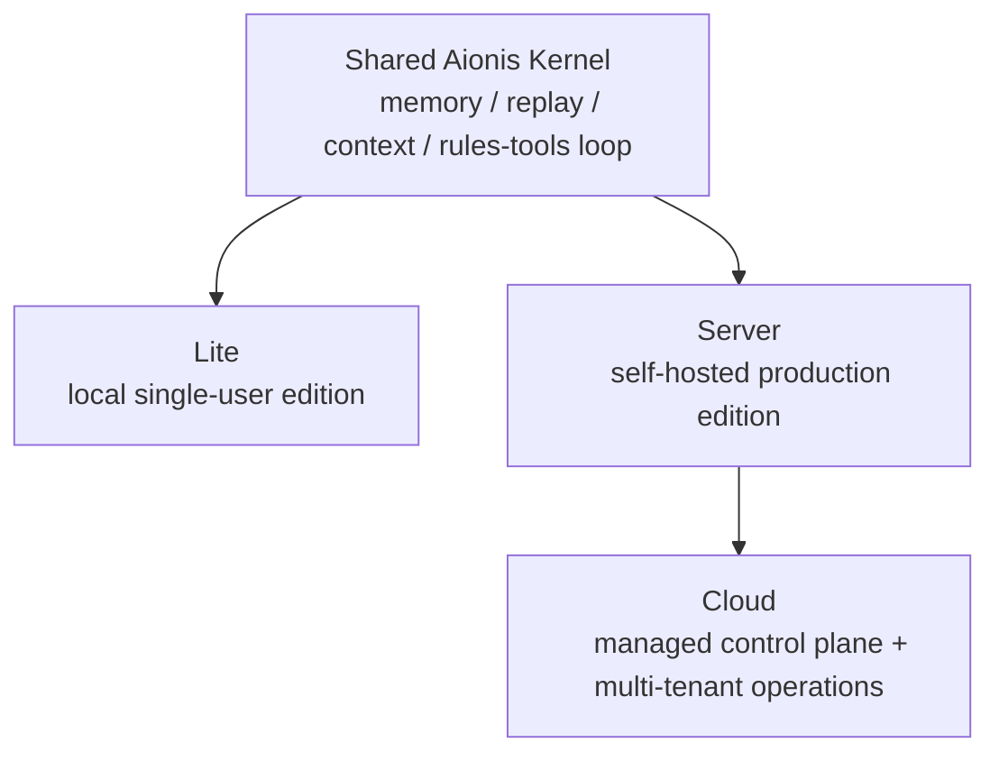

# Aionis 产品与商业分层方案

Last updated: `2026-03-12`  
Status: `working strategy`

## 1. Executive Summary

Aionis 现在已经不适合继续被表述成“一个产品 + 若干功能包”。

更自然、也更符合当前代码与发布状态的结构是：

1. `Aionis Lite`
2. `Aionis Server`
3. `Aionis Cloud`

推荐的商业模型不是完全闭源，也不是“只有 SaaS 没有可落地内核”的路线，而是：

**open-core with managed control plane**

也就是：

1. `Lite` 开源
2. `Server core` 开源
3. `Cloud control plane / multi-tenant governance / hosted operations` 闭源并商业化

一句话定义：

> Aionis 应该被包装成同一执行记忆内核在三种拓扑下的产品分层，而不是三个互不相关的版本。

## 2. Why This Structure Fits the Current Reality

当前仓库状态已经天然支持这个分层：

1. `Lite` 已经形成真实 edition，不再是实验分支  
   见 [AIONIS_LITE_STATUS_2026-03-11.md](/Users/lucio/Desktop/Aionis/docs/internal/progress/AIONIS_LITE_STATUS_2026-03-11.md)
2. `Server` 与 `Lite` 已经有明确 capability split  
   见 [AIONIS_LITE_VS_SERVER_ARCHITECTURE_ANALYSIS_2026-03-11.md](/Users/lucio/Desktop/Aionis/docs/internal/architecture/AIONIS_LITE_VS_SERVER_ARCHITECTURE_ANALYSIS_2026-03-11.md)
3. `Cloud` 所需的 control-plane / governance / automation / tenancy 能力，本来就在 Server-only 外层里长出来了

所以这个分层不是重新造故事，而是把现有架构边界正式产品化。

## 3. Canonical Product Stack

### 3.1 Aionis Lite

**定义**

Lite 是本地单用户版，是 Aionis kernel 的最低摩擦入口。

**核心特征**

1. single-user
2. local-first
3. SQLite-backed
4. 低运维负担
5. 保留 execution memory / replay / context assembly 的内核语义

**适合谁**

1. 个人开发者
2. 本地 agent / IDE / MCP 集成
3. 评估和 dogfood
4. 想先验证 memory + replay 价值、但不想先上 Docker + Postgres 的用户

**不该承诺什么**

1. Server parity
2. 多租户治理
3. automation orchestration
4. 生产级 control plane

当前发布姿态：

1. controlled public beta

### 3.2 Aionis Server

**定义**

Server 是自托管生产版，是团队和生产环境的主要落地形态。

**核心特征**

1. Postgres + production runtime topology
2. 团队/生产可部署
3. 完整 kernel + 较完整的生产外层
4. 支持 replay、packs、rules/tools、context runtime、automation、admin/control 等生产面

**适合谁**

1. 希望自托管的团队
2. 有数据控制要求的客户
3. 需要生产部署但不想上托管 Cloud 的组织

**商业角色**

1. 开源 adoption 主载体之一
2. enterprise/self-hosted 商业入口

### 3.3 Aionis Cloud

**定义**

Cloud 是托管版，是 Aionis 的主要商业化承载面。

**核心特征**

1. managed multi-tenant runtime
2. hosted control plane
3. quota / governance / audit / support / operational reliability
4. lowest deployment friction

**适合谁**

1. 不想自运维的团队
2. 要治理、控制台、审计、自动化的组织
3. 希望直接买结果和托管能力的客户

**商业角色**

1. recurring revenue 主来源
2. highest-value packaging layer

## 4. Product Layering Diagram

这个图的关键含义是：

1. `Lite` 和 `Server` 不是两套不同产品内核
2. `Cloud` 不是另一个内核，而是 `Server` 上层进一步托管化、平台化的商业形态

## 5. Open vs Closed Boundary

推荐边界如下。

### 5.1 Open Source

以下建议开源：

1. `Aionis Lite`
2. `Aionis Server core`
3. memory graph core
4. commit-chain and replay semantics
5. context orchestration
6. rules/tools policy loop
7. packs import/export bridge
8. self-hosted baseline host/runtime

原因：

1. Aionis 的差异化价值在 kernel，如果内核不开，市场很难形成心智
2. Lite 是最强 adoption 入口，不适合做闭源试用器
3. Server core 开源能形成标准化和自托管入口
4. 这符合当前的 `Kernel Standard + Managed Service + Execution Control` 策略  
   见 [COMMERCIAL_STRATEGY.md](/Users/lucio/Desktop/Aionis/docs/internal/strategy/COMMERCIAL_STRATEGY.md)

### 5.2 Commercial / Closed

以下建议闭源或商业许可：

1. Cloud control plane
2. multi-tenant org / identity / quota governance
3. hosted admin and operator console
4. managed automation governance workflows
5. enterprise audit/compliance integrations
6. managed observability / alerting / reliability tooling
7. premium support / SLA / enterprise packaging

原因：

1. 这些是长期 moat，不适合作为社区 baseline 全开放
2. 它们依赖持续运营，不只是源代码
3. 用户愿意为“少运维、可治理、可审计、可托管”买单

## 6. Suggested Commercial Model

### 6.1 Lite

商业姿态：

1. 开源
2. 免费
3. public beta -> GA 后持续作为漏斗入口

价值：

1. adoption
2. product education
3. MCP / IDE / agent builder ecosystem entry

### 6.2 Server

商业姿态：

1. core 开源
2. enterprise add-ons 可收费

可收费方向：

1. enterprise auth / SSO / org controls
2. advanced governance packs
3. paid support
4. certified builds / release channels
5. operational tooling bundles

### 6.3 Cloud

商业姿态：

1. 闭源托管服务
2. usage-based + seat + governance tier 混合收费

可收费方向：

1. team tier
2. enterprise tier
3. governance/compliance tier
4. managed automation/control-plane tier

## 7. Packaging Guidance

### 7.1 Public Narrative

对外不要讲成：

1. Lite = 阉割版
2. Server = 真正完整版
3. Cloud = 另一个产品

应该讲成：

1. Lite = local single-user edition
2. Server = self-hosted production edition
3. Cloud = managed production edition

### 7.2 Core Message

统一口径建议：

> Aionis is a memory-centered runtime kernel for agents, delivered in three forms: local, self-hosted, and managed.

中文可收成：

> Aionis 是一个以执行记忆为中心的 agent runtime kernel，提供本地版、自托管版和托管版三种形态。

## 8. Pricing Logic

建议收费逻辑不是按“有没有 memory”收费，而是按外层价值收费。

### Free / Open

1. kernel truth
2. local developer experience
3. self-hosted baseline

### Paid

1. scale
2. governance
3. tenant isolation
4. managed reliability
5. operator experience
6. enterprise integrations

一句话原则：

> Charge for operations, governance, and managed convenience. Do not hide the kernel truth.

## 9. Risks

### Risk 1: Lite becomes too strong and weakens Cloud conversion

Control:

1. keep Lite focused on local single-user workflows
2. do not pull Cloud/control-plane capability downward just to fill a matrix

### Risk 2: Server core too weak, no standardization momentum

Control:

1. keep self-hosted production single-tenant path real
2. do not cripple replay/context/runtime semantics in the open layer

### Risk 3: Cloud value proposition becomes fuzzy

Control:

1. price and position Cloud around governance and managed operation depth
2. make multi-tenant control plane and managed automation clearly hosted differentiators

## 10. Recommended Immediate Next Step

The next packaging move should be:

1. formalize the public product map as `Lite / Server / Cloud`
2. keep Lite public beta growing as the funnel
3. define self-hosted Server packaging pages
4. define Cloud capability page around governance, tenancy, and managed operations

Do **not** start by changing code to fit a new story.  
The story should be extracted from the code and release state that already exist.

## 11. Final Recommendation

Recommended final structure:

1. `Aionis Lite` = open-source local edition
2. `Aionis Server` = open-core self-hosted production edition
3. `Aionis Cloud` = closed-source managed service

This is the cleanest mapping from the current architecture to a durable commercial strategy.
