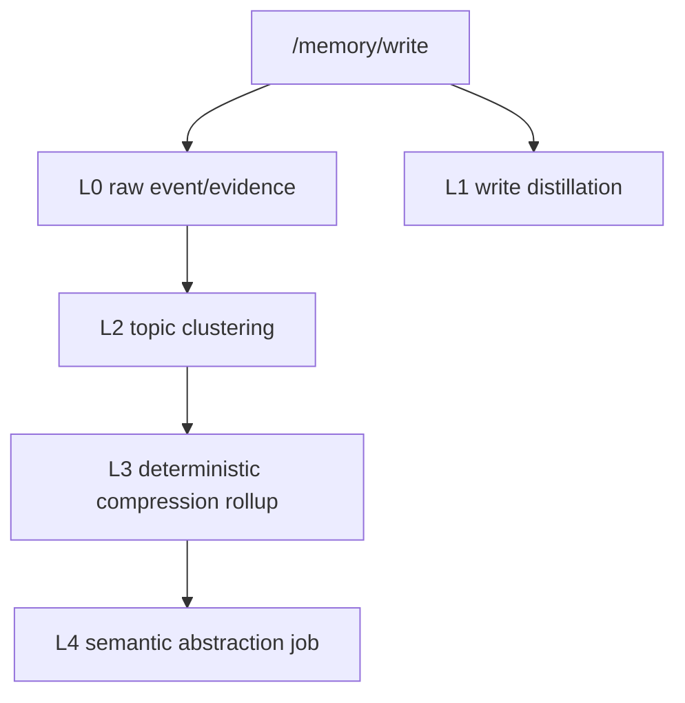

# Aionis Layered Compression Architecture Design

Date: 2026-03-12
Status: Proposed
Author: Codex

## 1. Executive Summary

结论先说：

1. Aionis 不只是"可以"分层做 memory compression，而是已经具备了分层架构的核心骨架。
2. 当前实现已经存在至少四个压缩相关层次，但这些层次还没有被统一建模为一个正式的 layered compression architecture。
3. 现阶段最合理的方向不是推倒现有 `compression-rollup`，而是在保留其可审计、确定性、可回放特性的前提下，新增一层可选的 semantic abstraction layer。
4. 推荐把 Aionis 的压缩体系正式定义为："derived-only, evidence-backed, budget-aware, layer-selective compression stack"。

当前最重要的判断：

- Aionis 已有的 `topic-cluster`、`compression-rollup`、`context.text` compaction、`context/assemble` layered orchestration，已经分别对应了结构聚合、摘要压缩、文本裁剪、运行时装配这几类不同层次。
- 真正缺的不是"分层能力"，而是：
  - 统一的层定义
  - 层间服务策略
  - semantic abstraction 的对象模型
  - 面向层的质量门禁和召回策略

因此，建议把 Aionis 的 memory compression 正式收束为 6 层：

1. `L0 Raw Evidence Layer`
2. `L1 Distilled Fact Layer`
3. `L2 Structural Aggregation Layer`
4. `L3 Deterministic Compression Layer`
5. `L4 Semantic Abstraction Layer`
6. `L5 Runtime Context Compaction Layer`

说明：`L5` 不是存储层，而是 serving layer；它不改变 memory graph 本体，而是控制模型实际看到的上下文。

## 2. Problem Statement

用户问题本质上不是"现在有没有 compression"，而是：

1. 当前 Aionis 的 compression 是否已经天然可分层。
2. 如果可分层，最佳分层边界应该在哪里。
3. 哪些层应当是 deterministic 的，哪些层可以引入更强语义抽象。
4. 哪些层属于 memory evolution，哪些层属于 runtime serving。
5. 如何在不破坏审计性与可回放性的情况下，把压缩能力升级为更强的长期记忆抽象能力。

## 3. Current State Review

### 3.1 Current Implemented Pieces

当前代码基线下，压缩相关能力分散在以下模块中：

- `src/memory/write-distillation.ts`
- `src/jobs/topicClusterLib.ts`
- `src/jobs/compression-rollup.ts`
- `src/memory/context.ts`
- `src/memory/context-orchestrator.ts`
- `src/routes/memory-context-runtime.ts`
- `src/memory/cost-signals.ts`
- `src/app/planning-summary.ts`

从职责上看，它们已经形成了实际上的多层链路：

1. 写入时蒸馏出额外 evidence/fact
2. event 聚入 topic
3. topic 下 event 生成 compression summary concept
4. recall 时优先 summary 并排除被 summary 覆盖的 event
5. context.text 在预算下删行
6. layered context assembly 按层预算、遗忘策略、静态注入再做一次 serving 侧压缩

### 3.2 What Exists Today

| Layer-like capability | Current implementation | Nature |
| --- | --- | --- |
| Write-time extraction | `distillWriteArtifacts(...)` | additive, non-destructive |
| Structural clustering | `runTopicClusterForEventIds(...)` | graph organization |
| Summary compression | `job:compression-rollup` | deterministic rollup |
| Recall-side de-dup | `buildContext(...)` | summary-first serving optimization |
| Budget compaction | `buildContext(...)` | line-level truncation |
| Layered assembly | `assembleLayeredContext(...)` | runtime orchestration |

### 3.3 What the Current System Is Optimized For

当前体系明显优化的是：

1. 可审计性
2. 可重放性
3. 可控的 token 成本
4. 非破坏式 memory evolution
5. bounded serving behavior

当前体系没有优先优化的是：

1. 深语义抽象
2. 自动模式发现
3. 决策级知识沉淀
4. 对冲突事实的高阶归纳

这是一个刻意的 trade-off，不是缺陷本身。

## 4. Can Aionis Be Layered?

答案是：**可以，而且应该。**

不是因为未来可以改造成分层，而是因为当前架构已经满足分层所需的 6 个前提条件。

### 4.1 Prerequisite A: Derived-only mutation exists

`docs/LONG_TERM_MEMORY_ROADMAP.md` 已明确 memory evolution 采用 async derived jobs，而不是原地重写 SoR。

这意味着 layered compression 可以继续沿用当前范式：

- 原始记忆保持为 source of record
- 高层压缩作为 derived artifacts
- 层与层之间通过 lineage 建立关系

### 4.2 Prerequisite B: Provenance is first-class

当前 `compression-rollup` 已保存：

- `citations[]`
- `source_event_ids`
- `source_event_hash`
- `derived_from` edges

这为后续引入 semantic abstraction 提供了最重要的安全条件：高层语义对象不是凭空存在，而是可回溯到下层 evidence。

### 4.3 Prerequisite C: Runtime already knows how to serve different representations

`buildContext(...)` 已经能做：

1. summary-first rendering
2. raw event fanout suppression
3. section-aware compaction

`assembleLayeredContext(...)` 已经能做：

1. facts / episodes / rules / static / tools / citations 分层
2. per-layer budget
3. forgetting policy
4. merge trace / dropped reasons

所以 serving plane 已经具备 layer-selective consumption 能力。

### 4.4 Prerequisite D: Cost signals and summaries exist

`buildLayeredContextCostSignals(...)` 与 `buildPlanningSummary(...)` 已经把 savings lever、forgotten items、selected static blocks 等指标收成标准摘要。

这意味着 layered compression 不只是模型设计问题，也已经具备 operator-facing observability 基础。

### 4.5 Prerequisite E: Current object model is extensible enough

虽然当前 `NodeType` 和 `EdgeType` 偏保守，但用现有 `concept` 节点加 `slots.summary_kind` 扩展新层是完全可行的。

这比新增一批 node/edge type 更现实，也更符合当前 kernel 的演进风格。

### 4.6 Prerequisite F: Kernel already treats context budget as a primitive

这点很关键。

`docs/AIONIS_KERNEL_ARCHITECTURE_SPEC.md` 已把 context budget / compaction / layered assembly 定义为 kernel primitive，而不是 UI feature。

所以 layered compression 在 Aionis 里不是"某个 feature"，而是 memory kernel 的自然延伸。

## 5. Why the Current Compression Is Not Yet a Formal Layered Architecture

虽然基础存在，但当前仍然不能算完整 layered compression architecture，主要有 7 个缺口。

### 5.1 No canonical layer model

当前系统有多种压缩行为，但没有统一层定义。结果是：

- `write_distillation_fact`
- `compression_rollup`
- `context_compaction`
- `layered_context`

这些能力彼此相关，但在对象语义上没有统一词汇。

### 5.2 No semantic abstraction layer

当前 `compression-rollup` 是模板化 rollup，不是 semantic abstraction。

它会把事件清单压短，但不会稳定地产出：

- root cause abstraction
- reusable constraint
- decision summary
- lesson learned
- unresolved risk

### 5.3 Recall ranking is not layer-aware

当前 recall 会偏好 compression concept，但这种偏好是局部逻辑，不是完整的 layer policy。

系统还没有明确回答：

1. 在什么预算下优先 L3 over L0
2. 在什么查询类型下优先 semantic abstraction over deterministic rollup
3. 在什么情况下必须回落到底层 evidence

### 5.4 No contradiction policy for abstractions

如果未来引入 semantic abstraction，必须解决：

- 抽象结论与新事实冲突怎么办
- 抽象陈旧怎么办
- 抽象不再被下层事实支持怎么办

当前只有 consolidation conflict policy，对 abstraction conflict 还没有正式机制。

### 5.5 No operator controls per compression layer

当前 operator 可以调：

- token budget
- char budget
- compaction profile
- topic cluster thresholds
- compression rollup thresholds

但还不能对层本身做治理，例如：

- 只启用 L3，不启用 L4
- L4 只对特定 scope/tenant 生效
- semantic abstraction 仅 shadow mode 写入

### 5.6 No layer-specific quality gates

现在有 compression KPI，但本质上仍是 token-side KPI。缺少：

- abstraction faithfulness
- evidence coverage
- contradiction rate
- stale abstraction rate

### 5.7 No formal split between storage compression and serving compression

当前文档层面容易把下面几件事混在一起：

1. graph 内产生更高层对象
2. recall 时优先读更高层对象
3. context text 裁剪
4. layered assembly 的 serving policy

这些应该明确分开。

## 6. Recommended Layered Compression Architecture

推荐方案：**在不破坏当前 object model 的前提下，采用 additive layered compression。**

### 6.1 Layer Definitions

#### L0 Raw Evidence Layer

对象：

- `event`
- `evidence`
- 原始 `raw_ref` / `evidence_ref`

职责：

- 保持 source-of-record 级别事实
- 提供最底层证据和回放输入

特点：

- 不压缩
- 不归纳
- 仅允许 tiering / forgetting / archive policy 影响默认可见性

#### L1 Distilled Fact Layer

对象：

- `concept` with `summary_kind=write_distillation_fact`
- `evidence` with `summary_kind=write_distillation_evidence`

职责：

- 从输入或节点中抽取更结构化、可复用的局部事实

特点：

- 写入侧生成
- additive
- 仍然非常贴近原文，不是高阶抽象

#### L2 Structural Aggregation Layer

对象：

- `topic`
- event -> topic 的 `part_of`

职责：

- 把零散事件组织成 thread / cluster

特点：

- 本质是结构压缩，不是文本压缩
- 为更高层摘要提供聚合边界

#### L3 Deterministic Compression Layer

对象：

- `concept` with `summary_kind=compression_rollup`

职责：

- 在 topic 边界内把事件列表压成稳定、可验证的 summary node

特点：

- deterministic
- citation-backed
- idempotent
- 可作为 recall 默认首选高层表示

#### L4 Semantic Abstraction Layer

对象：

- `concept` with new semantic abstraction kinds

建议新增 `summary_kind`：

- `semantic_abstraction_pattern`
- `semantic_abstraction_decision`
- `semantic_abstraction_constraint`
- `semantic_abstraction_risk`
- `semantic_abstraction_lesson`

职责：

- 从 L0-L3 的对象中提炼跨事件、跨阶段、跨 topic 的更高层知识

特点：

- 可由 model-assisted pipeline 生成
- 必须 evidence-backed
- 不可替代 L3，只能叠加在其上

#### L5 Runtime Context Compaction Layer

对象：

- `context.text`
- `layered_context`
- `cost_signals`

职责：

- 在 serving 时根据预算、任务、工具、执行上下文决定实际注入内容

特点：

- 不改变 memory graph state
- 只影响 runtime consumption

### 6.2 Recommended Serving Rule

推荐的 serving rule 不是永远优先最高层，而是：

1. 先按 query class 决定可见层
2. 再按 budget 决定优先层
3. 再按 confidence / freshness / evidence coverage 决定是否回退到底层

推荐默认策略：

- 查询"发生了什么"时，优先 `L3 + selective L0`
- 查询"为什么 / 教训 / 约束 / 下一步"时，允许 `L4 + L3 + selective L0`
- 高风险任务默认要求 `L3/L4` 的每条 claim 都能落回 citation
- 在 budget 紧张时先压 `L0`，最后才压 `L3`

## 7. Alternatives Considered

### Option A: Continue with current implicit layering only

优点：

- 零额外复杂度
- 不引入新的 abstraction risk

缺点：

- 现有能力继续分散
- 无法形成长期记忆产品层的明确叙事
- 后续 semantic compression 很难接入

结论：不推荐。

### Option B: Introduce a formal layered model using existing node types plus `slots.summary_kind`

优点：

- 最符合当前代码基线
- 与 `concept`/`topic`/`event` 语义兼容
- 迁移成本低
- 可逐层 rollout

缺点：

- `concept` 会承担较多语义角色
- 需要更强的 slots contract 和 consistency checks

结论：**推荐。**

### Option C: Add new dedicated node types for each compression layer

优点：

- 语义更显式
- 查询和调试更直观

缺点：

- 需要修改 `NodeType`
- 需要更广泛 API / SDK / docs / store / tests 变更
- 对当前阶段属于过度设计

结论：暂不推荐。

## 8. Architecture Decisions

### ADR-1: Keep deterministic rollup as the trust anchor

Decision:

保留 `compression-rollup` 作为默认高层摘要锚点，不被 semantic abstraction 替代。

Why:

- 它已具备 citation traceability
- 它 deterministic 且 idempotent
- 它适合做所有更高层抽象的中间层输入

Consequence:

- L4 必须建立在 L3 或 L0/L2 之上
- 不能直接让 semantic layer 成为唯一压缩来源

### ADR-2: Introduce semantic abstraction as additive `concept` variants

Decision:

语义抽象层继续使用 `concept`，通过 `slots.summary_kind` 区分。

Why:

- 避免扩大 kernel object surface
- 兼容当前 recall / resolve / URI 语义

Consequence:

- 需要更强的 slots schema 和 validation

### ADR-3: Separate storage compression from serving compression

Decision:

把 L0-L4 视为 storage-side derived layers，把 L5 视为 serving-side compression layer。

Why:

- 两者失败模式完全不同
- 一个改变 memory graph 结构，一个只改变 runtime output

Consequence:

- 监控、指标、runbook 也要分开

### ADR-4: Layer selection must be query-aware, not only budget-aware

Decision:

未来 recall/context serving 需要根据 query class 选择层，而不只是根据 token budget。

Why:

- "发生了什么" 和 "这说明什么" 对最优层的需求不同

Consequence:

- 需要引入 query intent / workload class 与 layer policy 的映射

### ADR-5: Semantic abstractions must be evidence-backed and degradable

Decision:

任何 L4 对象都必须：

1. 带 citation
2. 声明 source coverage
3. 可回退到底层表示
4. 支持 stale/contradiction handling

Why:

- 否则会破坏 Aionis 当前最重要的可信性叙事

## 9. Proposed Data Model Extensions

推荐不新增 node type，先扩展 `concept.slots`。

### 9.1 Common Layer Metadata

建议所有压缩层对象统一增加：

```json
{
  "compression_layer": "L3",
  "summary_kind": "compression_rollup",
  "source_node_ids": ["..."],
  "source_hash": "...",
  "generated_by": "job:compression-rollup",
  "generated_at": "2026-03-12T00:00:00Z",
  "freshness_basis": "source_hash",
  "evidence_coverage_ratio": 0.83
}
```

### 9.2 L4 Semantic Abstraction Metadata

建议新增字段：

```json
{
  "compression_layer": "L4",
  "summary_kind": "semantic_abstraction_pattern",
  "abstraction_scope": "topic",
  "abstraction_confidence": 0.78,
  "claim_style": "pattern",
  "claim_count": 3,
  "source_layers": ["L0", "L3"],
  "stale_after_days": 14,
  "conflict_policy": "shadow_on_conflict",
  "citations": [
    { "node_id": "..." }
  ]
}
```

### 9.3 Why no new edge types now

当前 `EdgeType` 只有：

- `part_of`
- `related_to`
- `derived_from`

短期内建议继续复用：

- `derived_from` 表示抽象的证据来源
- `part_of` 表示对象归属到 topic / run

原因：

- 更小变更面
- 更符合现有 schema 和 SDK

如果后续 semantic abstraction 成熟，再考虑引入更显式的抽象关系边。

## 10. Proposed Generation Pipeline

### 10.1 Storage-Side Pipeline



### 10.2 Recommended L4 Generation Modes

建议采用三阶段 rollout：

1. `shadow_generate`
   - 生成 L4，但 recall 默认不消费
2. `serve_opt_in`
   - 只有显式请求或指定 tenant/profile 才消费
3. `serve_default`
   - 在满足质量门禁后进入默认 serving path

### 10.3 Recommended L4 Inputs

L4 不应直接只看 raw events。推荐输入为：

- L3 deterministic rollups
- 相关 L0 citations
- topic metadata
- rule / decision / tool outcome signals

原因：

- L3 能先完成去噪和局部压缩
- L0 citation 可防止过度抽象
- rule / decision / tool signals 可让抽象更贴近 agent execution memory

## 11. Serving Architecture

### 11.1 Recommended recall policy by layer

建议把 recall serving 分成两步：

1. retrieval stage
   - 召回所有候选层对象
2. assembly stage
   - 根据 layer policy、budget policy、query class 选最终注入表示

### 11.2 Proposed layer preference matrix

| Query type | Preferred layers | Fallback |
| --- | --- | --- |
| factual recall | `L3 -> L0` | `L1` |
| chronology / incident reconstruction | `L3 + selective L0` | `L2` |
| planning / next action | `L4 + L3 + rules/tools` | `L0` |
| compliance / high-risk answer | `L3 + L0 citations` | avoid `L4-only` |
| pattern discovery | `L4 + L3` | `L2` |

### 11.3 Integration with current `context/assemble`

当前 `assembleLayeredContext(...)` 的层：

- facts
- episodes
- rules
- static
- decisions
- tools
- citations

建议不要把 compression layer 和 assembly layer 混成同一维度。

正确关系应是：

- compression layer 决定 memory object 的抽象层级
- assembly layer 决定 runtime context 的注入栏目

例如：

- `L3 compression_rollup` 通常进入 `facts`
- `L4 semantic_abstraction_decision` 可进入 `facts` 或 `decisions`
- `L0 event/evidence` 通常进入 `episodes` 和 `citations`

## 12. Quality Model

若正式引入 layered compression，必须新增质量门禁。

### 12.1 L3 Metrics

已有指标可继续使用：

- context compression ratio
- items retain ratio
- citations retain ratio

### 12.2 L4 Metrics

建议新增：

1. `abstraction_faithfulness`
2. `citation_coverage_ratio`
3. `unsupported_claim_rate`
4. `conflict_detected_rate`
5. `stale_abstraction_rate`
6. `fallback_to_lower_layer_rate`

### 12.3 Serving Metrics

建议新增：

1. `layer_selection_distribution`
2. `layer_budget_drop_distribution`
3. `high_layer_only_answer_rate`
4. `citation_backfill_rate`

## 13. Risks and Failure Modes

### 13.1 Over-abstraction

风险：

高层摘要丢失关键条件、例外、时间边界。

控制：

- L4 不得无 citation 输出
- 高风险 query 禁止只用 L4
- 默认保留 L3 作为 trust anchor

### 13.2 Abstraction drift

风险：

旧抽象被新事实推翻，但仍被 serving 使用。

控制：

- `source_hash` / freshness 检查
- stale TTL
- contradiction detector
- shadow demotion

### 13.3 Layer explosion

风险：

对象越来越多，反而增加 recall 复杂度。

控制：

- 每层 mutation caps
- 每 topic / run / time window 的上限
- 只在高价值 scope 启用 L4

### 13.4 Operator confusion

风险：

难以判断当前注入的是哪一层。

控制：

- 在 `assembly_summary` / `cost_signals` 中暴露 selected layers
- admin / playground 加 layer distribution 视图

## 14. Rollout Plan

### Phase 0: Formalize the layer model in docs and telemetry

目标：

- 先统一语言，不改核心行为

工作：

- 定义 L0-L5
- 在 telemetry / docs 中统一使用 layer 名称
- 给现有 `compression_rollup`、`write_distillation_*` 补 `compression_layer`

进度（2026-03-12）：

- 已完成：`compression_rollup` / `write_distillation_*` 写入 `compression_layer`
- 已完成：`planning_summary` / `assembly_summary` / `cost_signals` 暴露 `selected_memory_layers`
- 已完成：设计文档统一收束为 L0-L5

### Phase 1: Make serving policy explicitly layer-aware

目标：

- 让 recall / assemble 不是隐式偏好 L3，而是显式 layer policy

工作：

- 增加 layer preference config
- 在 summary/cost_signals 中输出 layer selection

进度（2026-03-12）：

- 已完成：输出 `selected_memory_layers`
- 已完成：把 endpoint-default layer preference 收束成独立 policy 模块
- 已完成：`recall.observability` / perf benchmark / perf report 暴露 layer selection 信号
- 已完成：playground inspector 暴露 selected layers / selection policy / trust anchors
- 已完成：admin diagnostics / ops dashboard 暴露 selection policy 与 memory-layer 分布
- 已完成：给调用方开放显式 layer preference override，但只允许收紧 endpoint-default layers，且自动保留 `L3/L0` trust anchors
- 已完成：admin diagnostics / ops dashboard 暴露 `selection_policy_source` 与 `requested_allowed_layers` 分布
- 已完成：perf benchmark / perf report / rollout gate 暴露 `selection_policy_source` 与 `requested_allowed_layers`，并支持可选 `request_override_ratio` gate
- 已完成：`memory_layer_preference.allowed_layers` 从“排序偏置”修正为“真实收紧”，并给 perf benchmark 增加 caller-tightened override cohort
- 已完成：给 perf benchmark 增加固定 preset（`endpoint_default_only` / `caller_tightened_l1` / `caller_tightened_l1_l3`）

### Phase 2: Add semantic abstraction in shadow mode

目标：

- 只写入 L4，不默认消费

工作：

- 新增 `job:semantic-abstraction`
- 只对 sample scope/tenant 跑
- 做 faithfulness / coverage / contradiction 评估

### Phase 3: Opt-in serving

目标：

- 对 planning/context 等高价值路径开放 L4

工作：

- 增加 query-aware layer serving policy
- 高风险路径保持 conservative fallback

### Phase 4: Default serving for qualified workloads

目标：

- 在通过质量门禁的 workload 上默认启用 L4

## 15. Implementation Notes

### 15.1 Minimal-path implementation recommendation

如果按最小风险推进，建议先做这 4 件事：

1. 给现有 `write_distillation_*` 和 `compression_rollup` 统一写 `compression_layer`
2. 在 recall / context assemble 的响应摘要里增加 `selected_memory_layers`
3. 把 layer preference policy 抽成单独配置模块
4. 新增一个 shadow-only `semantic abstraction` job

### 15.2 What should not be changed first

第一阶段不建议做：

1. 大规模新增 node type / edge type
2. 替换 `compression-rollup`
3. 把 L4 直接接入默认 factual recall
4. 引入不可回放的黑盒异步压缩流程

## 16. Final Recommendation

最终建议如下：

1. **正式承认 Aionis 已经是部分分层压缩系统。**
2. **把当前能力收束为 L0-L5 的统一 layered compression model。**
3. **保留 deterministic compression rollup 作为默认可信锚点。**
4. **把 semantic abstraction 设计成 additive、citation-backed、shadow-first 的新层，而不是替代层。**
5. **明确区分 storage-side compression 和 serving-side compaction。**
6. **让 layer-aware serving policy 成为下一阶段的核心改动，而不是直接追求更强摘要模型。**

一句话概括：

> Aionis 适合做分层压缩，但应该走"先统一层模型，再引入语义抽象，最后做 query-aware serving"这条路，而不是直接把现有 deterministic compression 替换成黑盒语义摘要。

## 17. Pointers to Current Implementation

- `src/memory/write-distillation.ts`
- `src/jobs/topicClusterLib.ts`
- `src/jobs/compression-rollup.ts`
- `src/memory/context.ts`
- `src/memory/recall.ts`
- `src/memory/context-orchestrator.ts`
- `src/routes/memory-context-runtime.ts`
- `src/memory/cost-signals.ts`
- `src/app/planning-summary.ts`
- `docs/LONG_TERM_MEMORY_ROADMAP.md`
- `docs/ADAPTIVE_COMPRESSION_PLAN.md`
