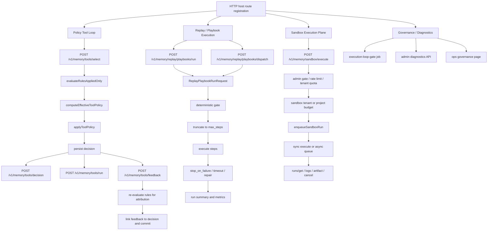
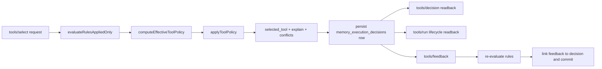
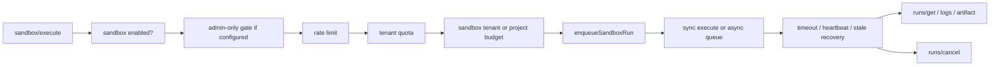

# Aionis Loop Control Audit

## Goal

Answer one precise question:

Does Aionis contain a first-class `Loop Control` feature?

And if not, what concrete runtime controls, gates, and observability surfaces together play that role?

This document is based on repository inspection of route registration, HTTP handlers, replay execution, sandbox execution, policy-tool feedback flow, and governance surfaces.

---

## Executive Summary

Short answer:

1. Aionis does **not** contain a first-class module, API, page, config block, or product surface literally named `Loop Control`.
2. Aionis **does** contain a real loop-control system in practice, but it is distributed across:
   - policy loop
   - replay/playbook execution control
   - sandbox execution control
   - execution-loop governance and diagnostics

The most defensible statement is:

1. **Do not claim that Aionis has a named feature called `Loop Control`.**
2. **Do claim that Aionis has execution control and closed-loop governance mechanisms.**

The runtime controls that most directly deserve the label "loop control" are:

1. `max_steps`
2. `stop_on_failure`
3. `timeout_ms`
4. deterministic replay gate
5. sandbox budget gate
6. sandbox cancel

The policy loop, feedback attribution loop, execution-loop gate, and ops dashboards are important, but they are more accurately described as:

1. closed-loop governance
2. decision traceability
3. policy observability
4. execution health gating

not as a single runtime loop-breaker primitive.

---

## Bottom-Line Verdict

### What exists

Aionis has an execution-control stack that spans:

1. policy-constrained tool selection
2. persisted decision records
3. feedback attribution back to decisions and rules
4. bounded playbook replay
5. controlled sandbox execution
6. governance gates and diagnostics

### What does not exist

The repository does not expose any of the following as a canonical feature name:

1. `Loop Control`
2. `loop_control`
3. `loop-control`
4. `loopControl`

So the correct conclusion is:

`Loop Control` is not a productized noun in Aionis.
It is an analyst shorthand for a group of controls that already exist.

---

## Terminology Boundary

If the team wants precise language, the clean split is:

### Runtime loop control

Controls that directly decide whether execution continues:

1. step caps
2. fail-fast behavior
3. execution timeout
4. deterministic gate rejection or fallback
5. budget rejection
6. cancellation

### Closed-loop governance

Controls that make execution measurable, attributable, and reviewable:

1. rules evaluation
2. tools selection with explain output
3. persisted decision records
4. feedback linked back to decisions and rules
5. run lifecycle readback
6. execution-loop gate
7. diagnostics and ops dashboards

This distinction matters because "loop control" implies hard runtime intervention, while many Aionis surfaces are actually governance and observability surfaces.

---

## End-to-End Architecture

### Top-Level Call Graph

### Route Registration Layer

The host wires all relevant surfaces together in one place:

1. policy tool routes
2. replay core routes
3. governed replay routes
4. sandbox routes
5. admin control dashboard routes

Primary registration point:

1. `src/host/http-host.ts`
   - `registerMemoryFeedbackToolRoutes(...)`
   - `registerMemoryReplayCoreRoutes(...)`
   - `registerMemoryReplayGovernedRoutes(...)`
   - `registerMemorySandboxRoutes(...)`
   - `registerAdminControlDashboardRoutes(...)`

This matters because it shows the repo does not hide loop-control logic in one subsystem. It is intentionally layered across policy, replay, sandbox, and governance.

---

## API-To-Execution Path Mapping

### 1. Policy Tool Loop

| API | Route Handler | Core Function | What It Does | Loop-Control Relevance |
| --- | --- | --- | --- | --- |
| `/v1/memory/tools/select` | `src/routes/memory-feedback-tools.ts` | `src/memory/tools-select.ts` | evaluates rules, applies tool policy, persists decision | weak control |
| `/v1/memory/tools/decision` | `src/routes/memory-feedback-tools.ts` | `src/memory/tools-decision.ts` | fetches a recorded decision | observability |
| `/v1/memory/tools/run` | `src/routes/memory-feedback-tools.ts` | `src/memory/tools-run.ts` | reads run lifecycle, decisions, feedback | observability |
| `/v1/memory/tools/feedback` | `src/routes/memory-feedback-tools.ts` | `src/memory/tools-feedback.ts` | attributes outcome back to rules and decision | governance loop |

#### Policy Tool Loop Detail

#### What is actually controlled here

This path controls:

1. which tool is selected
2. whether some tools are hard denied
3. whether an allowlist is enforced
4. whether `strict=false` permits fallback from allow-and-deny to deny-only

This is real behavior control, but it is not yet the strongest form of runtime loop control because it usually affects tool choice more than loop termination.

---

### 2. Replay / Playbook Execution Path

| API | Route Handler | Core Function | What It Does | Loop-Control Relevance |
| --- | --- | --- | --- | --- |
| `/v1/memory/replay/playbooks/run` | `src/routes/memory-replay-governed.ts` | `src/memory/replay.ts` | executes a playbook in `strict`, `guided`, or `simulate` mode | strong control |
| `/v1/memory/replay/playbooks/dispatch` | `src/routes/memory-replay-governed.ts` | `src/memory/replay.ts` | candidate lookup plus deterministic replay or fallback replay | strong control |
| `/v1/memory/replay/playbooks/repair/review` | `src/routes/memory-replay-governed.ts` | `src/memory/replay.ts` | review, shadow validation, optional promotion | governance + gated execution |

#### Replay Execution Detail

```mermaid
flowchart LR
  A["playbooks/run or dispatch"] --> B["parse request and mode"]
  B --> C["evaluate deterministic gate"]
  C --> D["load steps_template"]
  D --> E["slice to max_steps"]
  E --> F["for each step"]
  F --> G["preconditions / safety / backend selection"]
  G --> H["execute local or sandbox path"]
  H --> I["evaluate result and postconditions"]
  I --> J["failed or blocked?"]
  J -->|yes| K["stop_on_failure may break"]
  J -->|no| L["continue"]
  K --> M["run summary and replayRunEnd"]
  L --> M
```

#### Why this is the strongest loop-control layer

This path contains the most explicit runtime brakes:

1. `max_steps` is schema-defined and enforced by truncating `steps_template`
2. deterministic gate can reject or fallback before execution
3. `timeout_ms` is bounded and passed into execution
4. `stop_on_failure` actually stops subsequent steps
5. run summaries record `failed_steps`, `blocked_steps`, `pending_steps`

If one subsystem deserves the label "runtime loop control," it is replay/playbook execution.

---

### 3. Sandbox Execution Path

| API | Route Handler | Core Function | What It Does | Loop-Control Relevance |
| --- | --- | --- | --- | --- |
| `/v1/memory/sandbox/execute` | `src/routes/memory-sandbox.ts` | `src/memory/sandbox.ts` | queues or runs a sandbox command | strong control |
| `/v1/memory/sandbox/runs/get` | `src/routes/memory-sandbox.ts` | `src/memory/sandbox.ts` | gets run state | observability |
| `/v1/memory/sandbox/runs/logs` | `src/routes/memory-sandbox.ts` | `src/memory/sandbox.ts` | reads logs | observability |
| `/v1/memory/sandbox/runs/artifact` | `src/routes/memory-sandbox.ts` | `src/memory/sandbox.ts` | reads run artifact bundle | observability |
| `/v1/memory/sandbox/runs/cancel` | `src/routes/memory-sandbox.ts` | `src/memory/sandbox.ts` | requests cancellation | strong control |

#### Sandbox Detail

#### Why sandbox matters

Sandbox is the clearest "execution plane" control surface:

1. requests can be rejected before execution by budget
2. commands are allowlist-gated
3. execution is time-bounded
4. runs can be cancelled
5. remote execution has host and egress constraints

That is not just governance. It is direct execution control.

---

## Control Inventory By Grade

### Grade A: Strong Loop Control

These controls directly decide whether execution proceeds.

| Control | Why It Is Strong | Evidence |
| --- | --- | --- |
| `max_steps` | hard cap on number of replay steps considered | `src/memory/schemas.ts`, `src/memory/replay.ts` |
| `stop_on_failure` | actively breaks execution after failure | `src/memory/replay.ts`, `src/memory/automation.ts` |
| `timeout_ms` | hard execution time bound | `src/memory/replay.ts`, `src/memory/sandbox.ts`, sandbox docs |
| deterministic gate | rejects or falls back before execution | `src/memory/schemas.ts`, `src/memory/replay.ts` |
| sandbox budget gate | rejects execution with `429` before starting | `src/routes/memory-sandbox.ts`, `src/app/sandbox-budget.ts` |
| sandbox cancel | interrupts active or queued run lifecycle | `src/routes/memory-sandbox.ts` |

### Grade B: Weak or Indirect Loop Control

These controls shape execution but do not always stop it outright.

| Control | Why It Is Weak/Indirect | Evidence |
| --- | --- | --- |
| tool `allow / deny / prefer` | controls selected tool, not necessarily the whole loop | `src/memory/tool-policy.ts`, `src/memory/tool-selector.ts` |
| `strict=false` fallback | changes filtering behavior instead of stopping execution | `src/memory/tool-selector.ts` |
| replay mode `strict/guided/simulate` | changes execution semantics, but is not itself a brake | `src/mcp/dev/tools.ts`, `src/memory/replay.ts` |
| shadow policy | preview-only, visible but non-enforcing | `src/memory/rules-evaluate.ts`, benchmark docs |
| automation `stop_on_failure` | controls DAG progression at the automation layer, usually by delegating to replay | `src/memory/automation.ts` |

### Grade C: Observability and Governance Only

These surfaces do not directly stop a running loop, but they make the loop inspectable and governable.

| Surface | Role | Evidence |
| --- | --- | --- |
| `tools/decision` | decision readback | `src/memory/tools-decision.ts` |
| `tools/run` | lifecycle readback of decisions and feedback | `src/memory/tools-run.ts` |
| `tools/feedback` | attribution and learning loop | `src/memory/tools-feedback.ts` |
| execution-loop gate job | health and traceability thresholds | `src/jobs/execution-loop-gate.ts` |
| admin diagnostics API | tenant diagnostics | `src/routes/admin-control-dashboard.ts` |
| ops governance page | operator-facing execution-loop snapshot | `apps/ops/app/governance/page.jsx` |

---

## Where The Real Loop-Control Points Live

### 1. Step Bound

Replay requests define:

1. `max_steps` on run
2. `max_steps` on dispatch
3. `shadow_validation_max_steps` on repair review

And the implementation uses those caps to slice the step list before execution.

This is the cleanest proof that Aionis has a bounded execution loop.

### 2. Fail-Fast

Replay execution computes `stopOnFailure` and then breaks out of the step loop when a failure path is hit.

This is not cosmetic telemetry.
It changes control flow directly.

### 3. Time Bound

Replay and sandbox execution both clamp `timeout_ms`.
That means even when the loop wants to keep going, the execution substrate has a hard time boundary.

### 4. Pre-Execution Gating

Deterministic gate and sandbox budget gate both prevent certain runs from proceeding at all.
This is loop control at the boundary, before the first step executes.

### 5. Runtime Cancellation

Sandbox cancel is one of the few surfaces that can intervene after dispatch and alter an already active run lifecycle.

---

## Policy Loop Versus Loop Control

This distinction should be kept explicit.

### Policy loop

Policy loop in Aionis means:

1. evaluate rules
2. choose tool under policy
3. persist decision trace
4. observe outcome
5. link feedback back to rules and decision

This is real and publicly documented.
It is validated in benchmark evidence and public docs.

### Loop control

Loop control means:

1. limit step count
2. stop on failure
3. stop on timeout
4. reject execution on gate mismatch
5. reject execution on budget exhaustion
6. cancel an active run

The repo has these controls, but they are not collectively named as a product feature.

Therefore:

1. policy loop is an official Aionis concept
2. loop control is an internal analytical label

---

## Product Language Recommendations

### Safe To Say Externally

These phrases are accurate and supported by the codebase:

1. Aionis has a **policy and execution loop**
2. Aionis provides **bounded replay execution**
3. Aionis supports **execution control with step limits, failure stops, and timeouts**
4. Aionis includes **sandbox budget gates and cancellation**
5. Aionis provides **closed-loop governance with decision traceability and feedback attribution**

### Safe To Say Internally

These are useful internal shorthand terms:

1. loop-control stack
2. execution control plane
3. loop-governance layer
4. bounded execution path

### Not Recommended As Product Language

These are likely to mislead:

1. "Aionis has a feature called Loop Control"
2. "Loop Control is a standalone subsystem in Aionis"
3. "Loop Control is one API"
4. "Loop Control is only the policy loop"

The code does not support any of those claims cleanly.

### Best Naming Recommendation

If the team wants one umbrella phrase, the most defensible option is:

**Execution Control and Closed-Loop Governance**

Why this works:

1. "execution control" covers `max_steps`, fail-fast, timeout, gate, budget, cancel
2. "closed-loop governance" covers decision persistence, feedback attribution, lifecycle readback, and loop health gates

If a shorter phrase is needed:

**Bounded Execution Loop**

This is still safer than `Loop Control` because it implies implementation behavior rather than a named feature SKU.

---

## Suggested Internal Positioning

If this needs to be turned into internal product language, the clean formulation is:

> Aionis does not expose a single feature named `Loop Control`. Instead, it implements a bounded execution loop through replay limits, failure-stop behavior, deterministic gating, sandbox budgets, and execution cancellation, and surrounds that with closed-loop policy governance and operator diagnostics.

That statement is consistent with the repository.

---

## Evidence Index

### Route Registration

1. `src/host/http-host.ts`
2. `src/host/lite-edition.ts`

### Policy Tool Loop

1. `src/routes/memory-feedback-tools.ts`
2. `src/memory/tools-select.ts`
3. `src/memory/tools-decision.ts`
4. `src/memory/tools-run.ts`
5. `src/memory/tools-feedback.ts`
6. `src/memory/rules-evaluate.ts`
7. `src/memory/tool-policy.ts`
8. `src/memory/tool-selector.ts`

### Replay / Playbook Control

1. `src/routes/memory-replay-governed.ts`
2. `src/memory/schemas.ts`
3. `src/memory/replay.ts`
4. `src/mcp/dev/tools.ts`

### Sandbox Control

1. `src/routes/memory-sandbox.ts`
2. `src/memory/sandbox.ts`
3. `src/app/sandbox-budget.ts`
4. `docs/public/zh/reference/08-sandbox-api.md`

### Governance / Observability

1. `src/jobs/execution-loop-gate.ts`
2. `src/routes/admin-control-dashboard.ts`
3. `apps/ops/app/governance/page.jsx`
4. `docs/public/zh/policy-execution/00-policy-execution-loop.md`
5. `docs/public/zh/benchmarks/09-policy-tool-selection.md`

---

## Final Answer To The Original Question

If the original question is:

> "Aionis 里存不存在 Loop Control 的相关功能？"

The precise answer is:

1. **存在相关功能。**
2. **不存在名为 `Loop Control` 的单独功能。**
3. **最接近 `Loop Control` 的真实能力是 replay 和 sandbox 里的边界控制。**
4. **policy loop 和 execution-loop gate 更适合归类为闭环治理与可观测性，而不是狭义的 runtime loop breaker。**

That is the most technically defensible repository-level conclusion.
