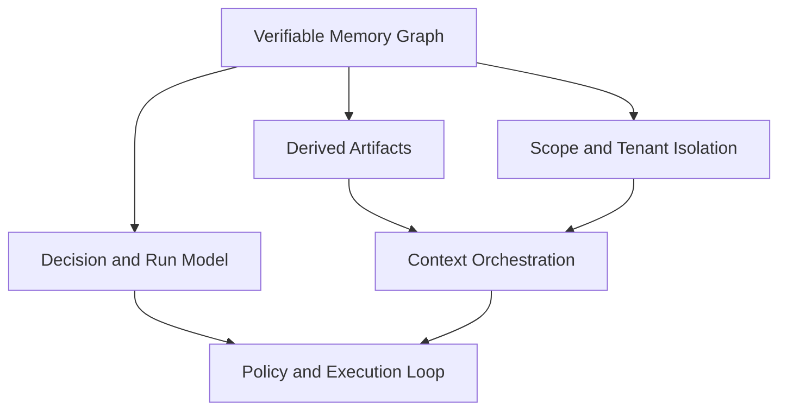

# Core Concepts

This section explains the runtime model behind Aionis after you already know which product path you are on.

If you still need product positioning first, read:

1. [Overview](/public/en/overview/01-overview)
2. [Get Started](/public/en/getting-started/01-get-started)
3. [Choose Lite vs Server](/public/en/getting-started/07-choose-lite-vs-server)

## Mental Model

Aionis runtime behavior is easier to understand through four concepts:

1. Verifiable memory state.
2. Derived asynchronous processing.
3. Tenant/scope isolation.
4. Decision-level execution provenance.

## Read in Order

1. [Verifiable Memory Graph](/public/en/core-concepts/01-verifiable-memory-graph)
2. [Derived Artifacts](/public/en/core-concepts/02-derived-artifacts)
3. [Scope and Tenant Isolation](/public/en/core-concepts/03-scope-and-tenant)
4. [Decision and Run Model](/public/en/core-concepts/04-decision-and-run-model)

These four concepts explain why Aionis can:

1. preserve project memory across sessions
2. assemble bounded planner context
3. track decisions and runs as first-class objects
4. recover or replay execution later

## Key Terms

1. `commit`: immutable write anchor for state lineage.
2. `decision`: policy decision linked to execution.
3. `run`: one execution chain instance.
4. `scope`: logical memory partition inside a tenant.
5. `context layer`: typed section of assembled planner context.

## Next Steps

1. [Architecture](/public/en/architecture/01-architecture)
2. [Context Orchestration](/public/en/context-orchestration/00-context-orchestration)
3. [Policy and Execution Loop](/public/en/policy-execution/00-policy-execution-loop)
