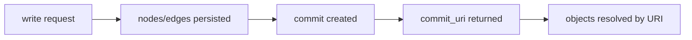

# Verifiable Memory Graph

Aionis stores memory as graph objects with commit-backed lineage so every change can be traced and replayed.

## Object Model

| Object | Purpose | Example ID |
| --- | --- | --- |
| Node | memory unit (`event/entity/topic/rule/...`) | `node_id` + `uri` |
| Edge | typed relation between nodes | `edge_id` + `uri` |
| Commit | immutable write anchor for one mutation set | `commit_id` + `commit_uri` |

## Write Lineage

Every successful write returns a commit anchor and affected objects.

## Why This Matters

1. `Auditability`: every memory mutation has a lineage anchor.
2. `Replayability`: incident analysis can start from `commit_uri` and expand deterministically.
3. `Interoperability`: SDKs and tools can treat URIs as stable object keys.
4. `Debug speed`: operators can jump from decision to commit to affected memory objects.

## Practical Usage Pattern

1. Persist `commit_uri` from every write in your application telemetry.
2. Persist `decision_id`/`run_id` for policy-influenced flows.
3. Use `POST /v1/memory/resolve` for incident inspection by URI.
4. Keep request/decision/commit links together in your logs.

## Recommended Adoption Milestones

1. Milestone 1: store `commit_uri` in application logs.
2. Milestone 2: resolve one sampled commit per release for validation.
3. Milestone 3: build runbook workflows around URI-based replay.

## Related

1. [API Contract](/public/en/api/01-api-contract)
2. [URI Object Coverage](/public/en/reference/07-uri-expansion-plan)
3. [Decision and Run Model](/public/en/core-concepts/04-decision-and-run-model)
