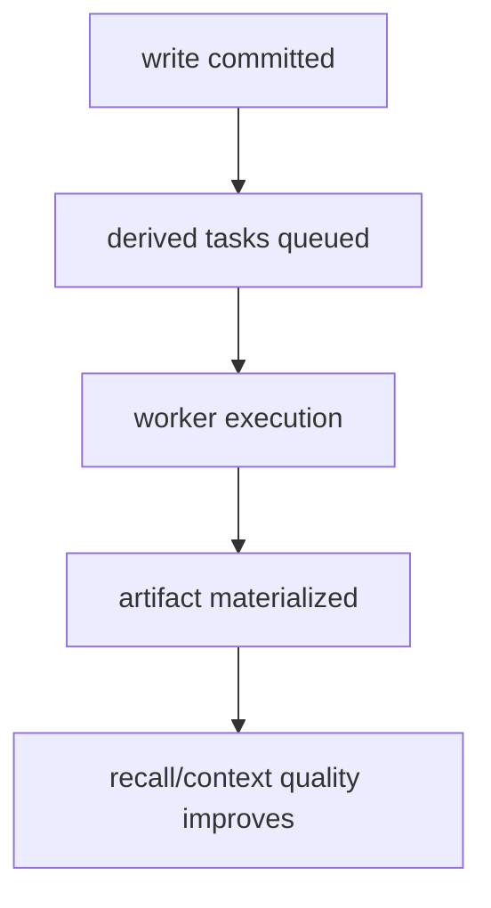

# Derived Artifacts

Aionis separates durable memory writes from derived processing so the core write path stays reliable.

## Derived Artifact Types

| Type | Role | Typical Consumer |
| --- | --- | --- |
| Embeddings | semantic retrieval acceleration | recall pipelines |
| Topic clusters | structure and grouping | analytics and context assembly |
| Context compression | budget-aware context reduction | planner/runtime callers |
| Consolidation outputs | long-horizon memory hygiene | operations workflows |

## Reliability Contract

1. Write durability does not depend on derived artifact completion.
2. Derived processing runs asynchronously and can be replayed when needed.
3. Recall and policy endpoints remain contract-stable during derived backlog spikes.

## Processing Flow

## Operational Guidance

1. Monitor derived queue depth and completion latency.
2. Treat sustained backlog growth as an SLO warning signal.
3. Use production gates before enabling aggressive derived policies.
4. Re-run benchmark snapshots after major derived policy changes.

## Product Impact

1. Higher write reliability under upstream model volatility.
2. Predictable user-facing behavior during transient provider issues.
3. Clear separation of concerns between durability and enrichment.

## Related

1. [Architecture](/public/en/architecture/01-architecture)
2. [Operator Runbook](/public/en/operations/02-operator-runbook)
3. [Performance Baseline](/public/en/benchmarks/05-performance-baseline)
