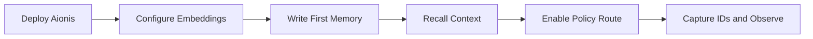

# Get Started

This guide gets a new team from zero to first production-ready integration path.

## Outcome Targets

In the first 30 minutes, you should be able to:

1. Run one `write -> recall_text` loop.
2. Confirm your embedding provider is active.
3. Run one policy route (`rules/evaluate` or `tools/select`).
4. Capture `request_id` and `commit_uri` from responses.

## Quick Path

1. [5-Minute Onboarding](/public/en/getting-started/02-onboarding-5min)
2. [Embedding Setup](/public/en/getting-started/03-embedding-setup)
3. [Playground](/public/en/guides/02-playground)

## Integration Flow



## Step 1: Choose Runtime Profile

| Profile | Recommended for | Next step |
| --- | --- | --- |
| Local/Dev | fast local validation | run 5-minute onboarding |
| Service | production baseline | run core gate before traffic |
| HA | scaled production | run go-live gate and drills |

## Step 2: Validate Core APIs

Minimum functional sequence:

1. `POST /v1/memory/write`
2. `POST /v1/memory/recall_text`
3. `POST /v1/memory/context/assemble` (optional but recommended)

Minimal write example:

```json
{
  "tenant_id": "default",
  "scope": "default",
  "input_text": "Customer prefers email follow-up"
}
```

Minimal recall example:

```json
{
  "tenant_id": "default",
  "scope": "default",
  "query_text": "preferred follow-up channel",
  "limit": 5
}
```

## Step 3: Add Policy Loop

Once memory retrieval works, add policy execution:

1. `POST /v1/memory/rules/evaluate`
2. `POST /v1/memory/tools/select`
3. `POST /v1/memory/tools/decision`
4. `POST /v1/memory/tools/run`
5. `POST /v1/memory/tools/feedback`

This enables governed routing and measurable behavior adaptation.

## Step 4: Wire Observability Early

Persist and expose these fields in your app telemetry:

1. `request_id`
2. `run_id`
3. `decision_id`
4. `commit_uri`

These are required for incident replay and release diagnostics.

## Step 5: Production Readiness Entry

Before production traffic:

1. [Production Core Gate](/public/en/operations/03-production-core-gate)
2. [Production Go-Live Gate](/public/en/operations/04-prod-go-live-gate)
3. [Operator Runbook](/public/en/operations/02-operator-runbook)

## Suggested Learning Order

1. [Architecture](/public/en/architecture/01-architecture)
2. [Context Orchestration](/public/en/context-orchestration/00-context-orchestration)
3. [Policy and Execution Loop](/public/en/policy-execution/00-policy-execution-loop)
4. [API Reference](/public/en/api-reference/00-api-reference)
