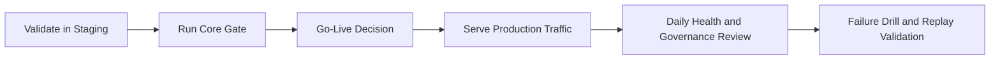

# Operate and Production

This page is the Server-side production path, not the local Lite path.

Use it when you are:

1. operating self-hosted Aionis for a team
2. preparing production rollout or HA expansion
3. validating gates, drills, and operator runbooks

If you are still evaluating Lite locally, go back to:

1. [Choose Lite vs Server](/public/en/getting-started/07-choose-lite-vs-server)
2. [Lite Operator Notes](/public/en/getting-started/04-lite-operator-notes)

Aionis production operation is built around a repeatable loop:

## Production Model

1. **Readiness**: release only after objective gate pass.
2. **Observability**: keep health, latency, and policy-loop quality visible.
3. **Replayability**: persist IDs needed for incident reconstruction.
4. **Resilience**: run regular rollback and recovery drills.

## Operating Cadence

### Daily

1. Check health/performance baseline.
2. Review governance drift indicators.
3. Validate one replay chain from recent traffic.

### Weekly

1. Run evidence and benchmark review.
2. Confirm rollback readiness.
3. Review drill outcomes and follow-ups.

## Where to Start

1. [Operate Index](/public/en/operations/00-operate)
2. [Production Core Gate](/public/en/operations/03-production-core-gate)
3. [Operator Runbook](/public/en/operations/02-operator-runbook)
4. [Standalone to HA Runbook](/public/en/operations/06-standalone-to-ha-runbook)

## Practical Reading Order

1. Run the core gate first.
2. Read the operator runbook before first traffic.
3. Use the HA runbook only when you are leaving the baseline deployment profile.
