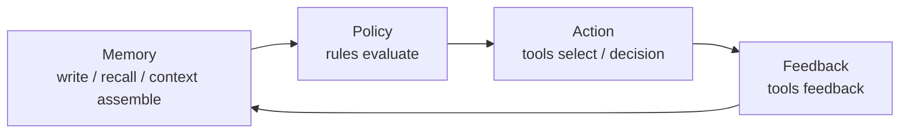

# Overview

Aionis is a **Memory Kernel** for AI systems that need durable memory, policy-aware execution, and replayable operations.

## 3-Minute Orientation

Aionis connects a single product loop:

1. Write and recall memory.
2. Assemble layered context.
3. Apply policy before action.
4. Record decisions and feedback.
5. Replay outcomes with stable IDs and URIs.

## Core Product Value

1. **Verifiable state**: write lineage (`commit_id`, `commit_uri`) is explicit.
2. **Controlled execution**: policy can influence routing and tool behavior.
3. **Replayability**: requests, runs, decisions, and commits can be reconstructed.
4. **Production readiness**: operation gates and runbooks are first-class surfaces.

## Memory -> Policy -> Action -> Replay

## Typical Use Cases

1. Support agents with long-lived customer context.
2. Workflow copilots that need stable tool routing.
3. Multi-tenant agent platforms with strict replay requirements.

## Start Here

1. [5-Minute Onboarding](/public/en/getting-started/02-onboarding-5min)
2. [Build Memory Workflows](/public/en/guides/01-build-memory)
3. [API Reference](/public/en/api-reference/00-api-reference)

## Next Steps

1. [Core Concepts](/public/en/core-concepts/00-core-concepts)
2. [Architecture](/public/en/architecture/01-architecture)
3. [Operate and Production](/public/en/operate-production/00-operate-production)
4. [Docs Navigation Map](/public/en/overview/02-docs-navigation)
