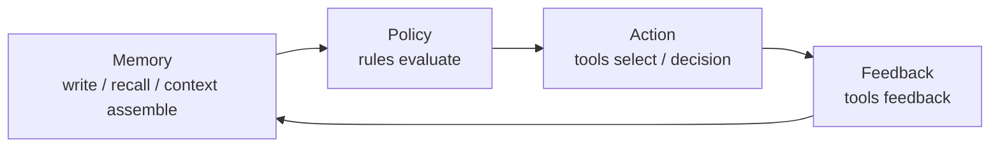

# Overview

Aionis is execution memory for coding agents.

Its job is simple: stop making every new session reread the repository, rebuild the same context, and restate the same reasoning before useful work can continue.

## 3-Minute Orientation

Aionis connects one product loop:

1. write and recall memory
2. assemble bounded context
3. apply policy before action
4. execute with traceable decisions and feedback
5. replay and recover work with stable IDs and URIs

## What Makes It Valuable

1. **Continuity**: the next session resumes work instead of starting from zero.
2. **Recoverable handoff**: task state can come back as structured artifacts, not just vague summaries.
3. **Replayable execution**: successful runs can become reusable playbooks.
4. **Reviewable evidence**: commits, runs, decisions, and URIs make behavior auditable.
5. **Production shape**: gates, diagnostics, and runbooks exist because the system is meant to be operated, not only demoed.

## Memory -> Policy -> Action -> Replay

## Typical Use Cases

1. coding agents that revisit the same repository across sessions
2. copilots that need stable tool routing instead of ad hoc prompting
3. teams that want replay, governance, and evidence instead of one-off chat outputs

## What It Is Not

1. not just a vector memory plugin
2. not just prompt compression
3. not just a token optimization trick

The public proof is stronger than that:

1. larger-project continuation tests already show measurable token reduction
2. Codex + MCP flows already recover handoff and replay real work
3. Lite already exists as a usable local product path

## Start Here

1. [Choose Lite vs Server](/public/en/getting-started/07-choose-lite-vs-server)
2. [5-Minute Onboarding](/public/en/getting-started/02-onboarding-5min)
3. [Build Memory Workflows](/public/en/guides/01-build-memory)
4. [API Reference](/public/en/api-reference/00-api-reference)

## Next Steps

1. [Core Concepts](/public/en/core-concepts/00-core-concepts)
2. [Architecture](/public/en/architecture/01-architecture)
3. [Context Orchestration](/public/en/context-orchestration/00-context-orchestration)
4. [Benchmarks](/public/en/benchmarks/01-benchmarks)
5. [Operate and Production](/public/en/operate-production/00-operate-production)
