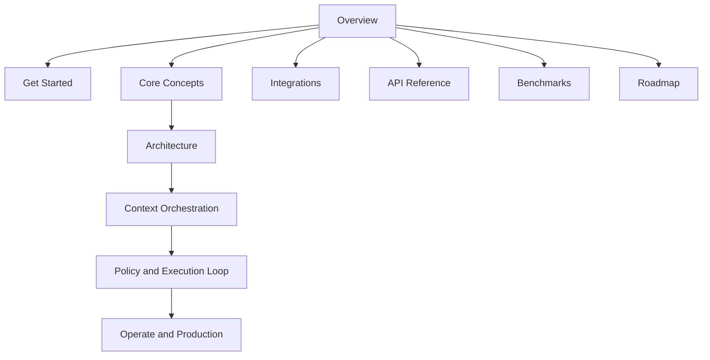

# Docs Navigation Map

Use this page to choose the fastest path through Aionis documentation.

## If You Are New (10 Minutes)

1. [Overview](/public/en/overview/01-overview)
2. [5-Minute Onboarding](/public/en/getting-started/02-onboarding-5min)
3. [Build Memory Workflows](/public/en/guides/01-build-memory)
4. [Role-Based Reading Paths](/public/en/overview/03-role-based-paths)

## If You Are Integrating in Production (30 Minutes)

1. [API Reference](/public/en/api-reference/00-api-reference)
2. [SDK Guide](/public/en/reference/05-sdk)
3. [Context Orchestration](/public/en/context-orchestration/00-context-orchestration)
4. [Policy and Execution Loop](/public/en/policy-execution/00-policy-execution-loop)

## If You Are Operating a Live System

1. [Operate and Production](/public/en/operate-production/00-operate-production)
2. [Production Core Gate](/public/en/operations/03-production-core-gate)
3. [Operator Runbook](/public/en/operations/02-operator-runbook)
4. [Standalone to HA Runbook](/public/en/operations/06-standalone-to-ha-runbook)

## Full Information Architecture

## Category Reminder

Aionis is a Memory Kernel, not only a retrieval utility. The documentation is structured to show the full loop:

`Memory -> Policy -> Action -> Replay`
