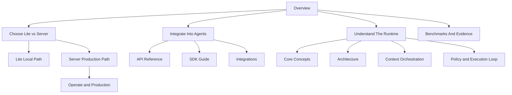

# Docs Navigation Map

Use this page to choose the shortest reading path based on how you want to use Aionis.

## Start Here

1. [Overview](/public/en/overview/01-overview)
2. [Get Started](/public/en/getting-started/01-get-started)
3. [Choose Lite vs Server](/public/en/getting-started/07-choose-lite-vs-server)

## If You Want Local Aionis Fast

1. [5-Minute Onboarding](/public/en/getting-started/02-onboarding-5min)
2. [Lite Operator Notes](/public/en/getting-started/04-lite-operator-notes)
3. [Lite Public Beta Boundary](/public/en/getting-started/05-lite-public-beta-boundary)
4. [Lite Troubleshooting and Feedback](/public/en/getting-started/06-lite-troubleshooting-and-feedback)

## If You Want To Integrate Aionis Into Agents

1. [Build Memory Workflows](/public/en/guides/01-build-memory)
2. [API Reference](/public/en/api-reference/00-api-reference)
3. [SDK Guide](/public/en/reference/05-sdk)
4. [Integrations](/public/en/integrations/00-overview)
5. [Codex Local](/public/en/integrations/05-codex-local)

## If You Want To Self-Host For Production

1. [Choose Lite vs Server](/public/en/getting-started/07-choose-lite-vs-server)
2. [Operate and Production](/public/en/operate-production/00-operate-production)
3. [Operator Runbook](/public/en/operations/02-operator-runbook)
4. [Production Core Gate](/public/en/operations/03-production-core-gate)
5. [Standalone to HA Runbook](/public/en/operations/06-standalone-to-ha-runbook)

## If You Want To Understand The Runtime

1. [Core Concepts](/public/en/core-concepts/00-core-concepts)
2. [Architecture](/public/en/architecture/01-architecture)
3. [Context Orchestration](/public/en/context-orchestration/00-context-orchestration)
4. [Policy and Execution Loop](/public/en/policy-execution/00-policy-execution-loop)
5. [Benchmarks](/public/en/benchmarks/05-performance-baseline)

## Full Product Map

## Reading Rule

Start from the product path you need first. Read concept pages after you know whether you are evaluating Lite, integrating the API, or operating Server.
