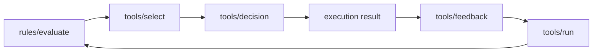

# Policy and Execution Loop

Aionis policy loop governs how memory influences execution behavior.

## Loop Stages

1. Evaluate rules against runtime context.
2. Select tools under policy constraints.
3. Record decision provenance.
4. Capture outcome feedback.
5. Inspect run lifecycle (`tools/run`) for decision/feedback linkage.
6. Reapply updated policy in future runs.

## Rule Lifecycle

1. `draft`: candidate rule definition.
2. `shadow`: observed before full enforcement.
3. `active`: participates in production decisions.
4. `disabled`: retained for audit, excluded from routing.

## Control Objectives

1. Improve success and stability vs retrieval-only routing.
2. Keep behavior explainable through decision/rule linkage.
3. Bound adaptation with explicit gates before promotion.

## Operational Metrics

1. Decision-link coverage.
2. Feedback-link coverage.
3. Negative-outcome ratio drift.
4. Rule freshness and stale-active counts.

## Recommended Deployment Pattern

1. Run in shadow-first mode for new rule sets.
2. Validate with execution and adaptation gates.
3. Promote to active only after threshold pass.
4. Keep rollback payloads available in release windows.

## Start Here

1. Normalize planner context for your runtime.
2. Integrate `rules/evaluate` before `tools/select`.
3. Persist `request_id`, `run_id`, and `decision_id`.

## Next Steps

1. [Execution Loop Gate](/public/en/control/03-execution-loop-gate)
2. [Policy Adaptation Gate](/public/en/control/04-policy-adaptation-gate)
3. [Production Core Gate](/public/en/operations/03-production-core-gate)

## Related

1. [Control and Policy](/public/en/control/01-control-policy)
2. [Rule Lifecycle](/public/en/control/02-rule-lifecycle)
3. [Execution Loop Gate](/public/en/control/03-execution-loop-gate)
4. [Policy Adaptation Gate](/public/en/control/04-policy-adaptation-gate)
