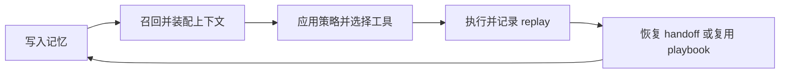

# Aionis 一页说明

## Aionis 是什么

Aionis 是一个以 memory 为中心、同时具备成本感知能力的 agent runtime kernel。它适合需要这些能力的 AI 产品：

1. 跨会话持久记忆
2. 结构化上下文编排
3. 可重放执行
4. 策略感知路由与可审计运行状态

## 产品结构

### Lite

本地单用户、SQLite-backed 的版本，适合评估、agent workflow 和 public beta 使用。

### Server

面向团队自托管生产路径的 open-core 运行时。

### Cloud

托管 control-plane 方向，当前不在公开 open-core 仓库内。

## 为什么它有价值

Aionis 的价值在于：新会话不必每次都从零开始。

它把运行时从：

1. 重新读一遍
2. 重新拼上下文
3. 重新决定怎么执行

变成：

1. 恢复项目记忆
2. 只装配必要上下文
3. 复用执行产物和 handoff

## 证据

这些不是纯文案主张：

1. Aionis 已经公开了 runtime 与优化行为的 benchmark 材料，先看 [基准测试](/public/zh/benchmarks/05-performance-baseline)。
2. Lite 也不是只停留在概念层，公开文档已经明确了 public beta 边界、operator notes 和 troubleshooting 路径。
3. 项目已经通过内部 dogfood 与 A/B 实验验证了 continuity、replay 和节省成本的行为，现在公开文档重构也会围绕这些已验证行为，而不是只靠叙事。

## 核心运行闭环

## 最适合的入口

1. [快速开始](/public/zh/getting-started/01-get-started)
2. [选择 Lite 还是 Server](/public/zh/getting-started/07-choose-lite-vs-server)
3. [集成总览](/public/zh/integrations/00-overview)
4. [运维与生产](/public/zh/operate-production/00-operate-production)
