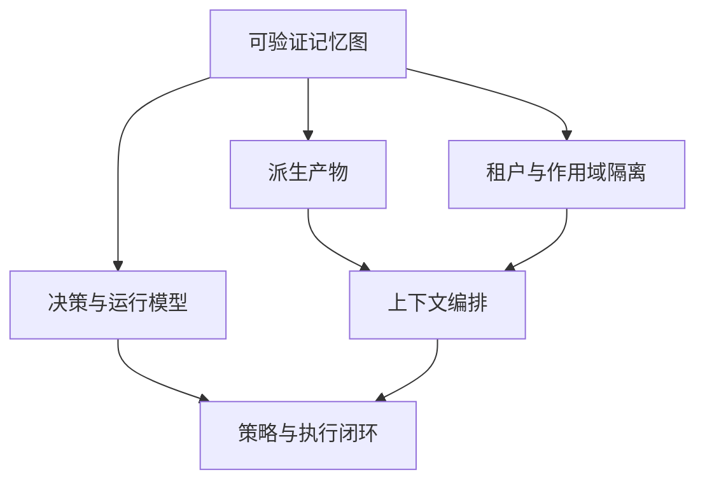

# 核心概念

本节定义 Aionis 作为 Memory Kernel 的核心模型。

## 心智模型

Aionis 由四个核心概念组成：

1. 可验证记忆状态。
2. 异步派生处理。
3. 租户/作用域隔离。
4. 决策级执行溯源。

## 推荐阅读顺序

1. [可验证记忆图](/public/zh/core-concepts/01-verifiable-memory-graph)
2. [派生产物](/public/zh/core-concepts/02-derived-artifacts)
3. [租户与作用域隔离](/public/zh/core-concepts/03-scope-and-tenant)
4. [决策与运行模型](/public/zh/core-concepts/04-decision-and-run-model)

## 关键术语

1. `commit`：不可变写入锚点。
2. `decision`：与执行关联的策略决策。
3. `run`：一次多步执行链。
4. `scope`：租户内逻辑分区。
5. `context layer`：拼装上下文中的类型化层。

## 下一步

1. [架构](/public/zh/architecture/01-architecture)
2. [上下文编排](/public/zh/context-orchestration/00-context-orchestration)
3. [策略与执行闭环](/public/zh/policy-execution/00-policy-execution-loop)
