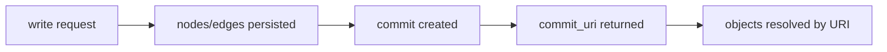

# 可验证记忆图

Aionis 以图对象存储记忆，并通过 commit 链保证每次变更都可追踪、可回放。

## 对象模型

| 对象 | 作用 | 示例标识 |
| --- | --- | --- |
| Node | 记忆单元（`event/entity/topic/rule/...`） | `node_id` + `uri` |
| Edge | 节点间类型关系 | `edge_id` + `uri` |
| Commit | 一次写入变更集的不可变锚点 | `commit_id` + `commit_uri` |

## 写入链路

每次成功写入都会返回 commit 锚点与受影响对象。

## 价值

1. 可审计：每次记忆变更都有链路锚点。
2. 可回放：可从 `commit_uri` 出发做确定性分析。
3. 可互操作：SDK 与工具可把 URI 当稳定主键。
4. 运维高效：可从 decision 快速跳转到受影响对象。

## 实践建议

1. 将每次写入的 `commit_uri` 持久化到业务日志。
2. 策略流程同时保存 `decision_id` 与 `run_id`。
3. 用 `POST /v1/memory/resolve` 做 URI 检查。
4. 将 request/decision/commit 关联存储。

## 相关页面

1. [API 合约](/public/zh/api/01-api-contract)
2. [URI 对象覆盖](/public/zh/reference/07-uri-expansion-plan)
3. [决策与运行模型](/public/zh/core-concepts/04-decision-and-run-model)
