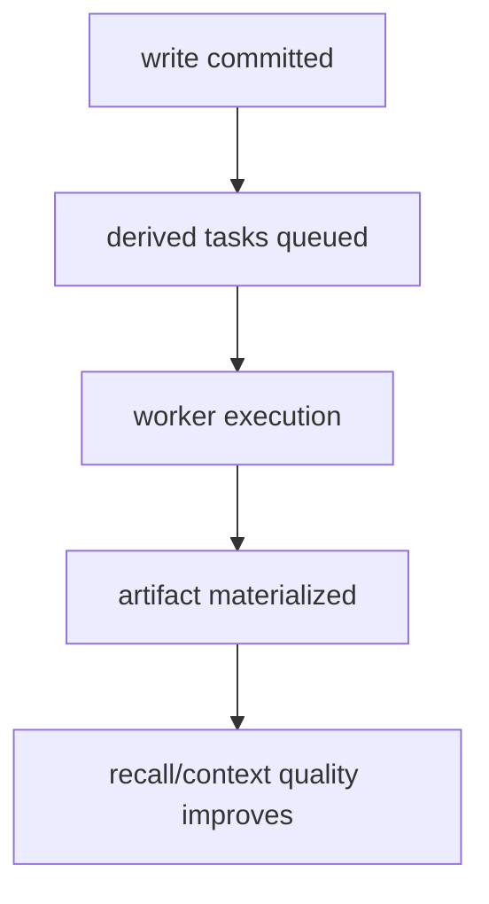

# 派生产物

Aionis 将“持久写入”与“派生处理”解耦，确保核心写入路径在负载和上游波动下依然稳定。

## 派生产物类型

| 类型 | 作用 | 典型消费者 |
| --- | --- | --- |
| Embeddings | 语义召回加速 | recall 流水线 |
| Topic 聚类 | 结构化分组 | 分析与上下文拼装 |
| 上下文压缩 | 在预算内压缩上下文 | planner/runtime |
| 合并产物 | 长周期记忆治理 | 运维流程 |

## 可靠性契约

1. 写入成功不依赖派生产物完成。
2. 派生流程异步执行，必要时可回放。
3. 派生积压时，召回与策略接口保持契约稳定。

## 处理流程

## 运维建议

1. 监控派生队列深度与完成延迟。
2. 长时间积压应视作 SLO 预警。
3. 启用激进派生策略前先通过生产门禁。
4. 派生策略大改后重新跑基准快照。

## 产品影响

1. 上游模型波动时写入可靠性更高。
2. 短时故障下用户侧行为更可预测。
3. 耐久层与增强层职责清晰。

## 相关页面

1. [架构](/public/zh/architecture/01-architecture)
2. [运维手册](/public/zh/operations/02-operator-runbook)
3. [性能基线](/public/zh/benchmarks/05-performance-baseline)
