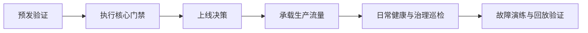

# 运维与生产

Aionis 的生产运维围绕一个可重复闭环：

## 生产模型

1. 就绪性：通过客观门禁后再发布。
2. 可观测性：持续监控健康、延迟、策略质量。
3. 可回放性：持久化事故重建所需 ID。
4. 韧性：定期执行回滚与恢复演练。

## 运维节奏

### 每日

1. 检查健康与性能基线。
2. 审阅治理漂移指标。
3. 抽样验证一条可回放链路。

### 每周

1. 运行证据与基准回顾。
2. 确认回滚可用性。
3. 复盘演练结果与后续动作。

## 从这里开始

1. [运维索引](/public/zh/operations/00-operate)
2. [生产核心门禁](/public/zh/operations/03-production-core-gate)
3. [运维手册](/public/zh/operations/02-operator-runbook)
4. [Standalone 到 HA 手册](/public/zh/operations/06-standalone-to-ha-runbook)
