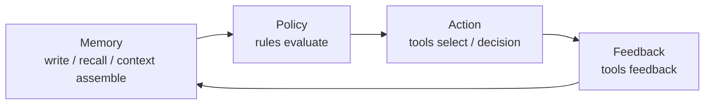

# 总览

Aionis 是面向 AI 系统的 **Memory Kernel**，提供持久记忆、策略驱动执行与可回放运维能力。

## 3 分钟认知

Aionis 把产品链路统一为：

1. 写入与召回记忆。
2. 组装分层上下文。
3. 在行动前应用策略。
4. 记录决策与反馈。
5. 通过稳定 ID/URI 做回放。

## 核心价值

1. 可验证状态：写入链路 (`commit_id`, `commit_uri`) 明确。
2. 可控执行：策略可直接影响工具路由与行为。
3. 可回放：请求、运行、决策、提交可重建。
4. 闭环学习：批准的回放修复可投影为规则/情景记忆，并作用于后续运行（`Replay -> Review -> Learning Projection -> Next Execution`）。
5. 生产就绪：门禁与运维手册是产品内建能力。

## Memory -> Policy -> Action -> Replay

## 典型场景

1. 长周期客服/销售 Agent 记忆。
2. 需要稳定工具路由的工作流 Copilot。
3. 需要严格隔离与回放能力的多租户平台。

## 从这里开始

1. [5 分钟上手](/public/zh/getting-started/02-onboarding-5min)
2. [构建记忆工作流](/public/zh/guides/01-build-memory)
3. [API 参考](/public/zh/api-reference/00-api-reference)

## 下一步

1. [核心概念](/public/zh/core-concepts/00-core-concepts)
2. [架构](/public/zh/architecture/01-architecture)
3. [运维与生产](/public/zh/operate-production/00-operate-production)
4. [文档导航图](/public/zh/overview/02-docs-navigation)
