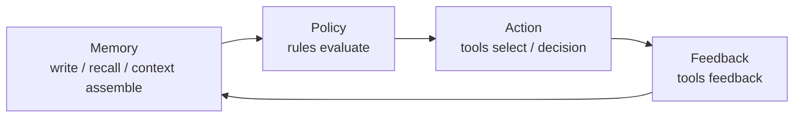

# 总览

Aionis 给 Coding Agent 提供执行记忆。

它要解决的问题很直接：不要让每个新会话都重新读仓库、重新建立上下文、重新解释同样的推理过程。

## 3 分钟认知

Aionis 把产品链路统一为：

1. 写入与召回记忆
2. 组装有预算约束的上下文
3. 在行动前应用策略
4. 记录可追踪的决策与反馈
5. 用稳定 ID/URI 回放和恢复工作

## 为什么有价值

1. **连续性**：新会话可以继续工作，而不是从零开始。
2. **可恢复交接**：任务状态可以作为结构化 artifact 恢复，而不是只剩模糊摘要。
3. **可复用执行**：成功运行可以沉淀成可回放 playbook。
4. **可审计证据**：commit、run、decision、URI 让行为可追踪。
5. **生产形态**：门禁、诊断和 runbook 是内建能力，不是上线后再补。

## Memory -> Policy -> Action -> Replay

## 典型场景

1. 需要跨会话继续同一个代码库任务的 Agent
2. 需要稳定工具路由而不是临时 prompt 技巧的 Copilot
3. 需要 replay、治理和可审计证据的团队系统

## 它不是什么

1. 不只是一个向量记忆插件
2. 不只是 prompt 压缩工具
3. 不只是 token 优化技巧

公开证据现在已经更强：

1. 更大项目的 continuation test 已经跑出真实 token 下降
2. Codex + MCP 链路已经能恢复 handoff 和 replay 真任务
3. Lite 已经是可用的本地产品路径

## 从这里开始

1. [先选 Lite 还是 Server](/public/zh/getting-started/07-choose-lite-vs-server)
2. [5 分钟上手](/public/zh/getting-started/02-onboarding-5min)
3. [构建记忆工作流](/public/zh/guides/01-build-memory)
4. [API 参考](/public/zh/api-reference/00-api-reference)

## 下一步

1. [核心概念](/public/zh/core-concepts/00-core-concepts)
2. [架构](/public/zh/architecture/01-architecture)
3. [上下文编排](/public/zh/context-orchestration/00-context-orchestration)
4. [基准测试](/public/zh/benchmarks/01-benchmarks)
5. [运维与生产](/public/zh/operate-production/00-operate-production)
