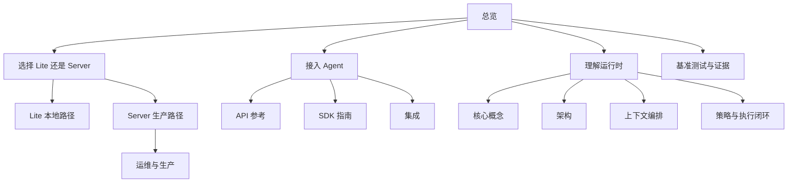

# 文档导航图

用本页按产品路径找到最短阅读顺序。

## 从这里开始

1. [总览](/public/zh/overview/01-overview)
2. [快速开始](/public/zh/getting-started/01-get-started)
3. [选择 Lite 还是 Server](/public/zh/getting-started/07-choose-lite-vs-server)

## 如果你想先本地用起来

1. [5 分钟上手](/public/zh/getting-started/02-onboarding-5min)
2. [Lite 运维说明](/public/zh/getting-started/04-lite-operator-notes)
3. [Lite Public Beta 边界](/public/zh/getting-started/05-lite-public-beta-boundary)
4. [Lite 排障与反馈](/public/zh/getting-started/06-lite-troubleshooting-and-feedback)

## 如果你想把 Aionis 接进 Agent

1. [构建记忆工作流](/public/zh/guides/01-build-memory)
2. [API 参考](/public/zh/api-reference/00-api-reference)
3. [SDK 指南](/public/zh/reference/05-sdk)
4. [集成](/public/zh/integrations/00-overview)
5. [Codex 本地集成](/public/zh/integrations/05-codex-local)

## 如果你想做生产自托管

1. [选择 Lite 还是 Server](/public/zh/getting-started/07-choose-lite-vs-server)
2. [运维与生产](/public/zh/operate-production/00-operate-production)
3. [运维手册](/public/zh/operations/02-operator-runbook)
4. [生产核心门禁](/public/zh/operations/03-production-core-gate)
5. [Standalone 到 HA 手册](/public/zh/operations/06-standalone-to-ha-runbook)

## 如果你想理解运行时本身

1. [核心概念](/public/zh/core-concepts/00-core-concepts)
2. [架构](/public/zh/architecture/01-architecture)
3. [上下文编排](/public/zh/context-orchestration/00-context-orchestration)
4. [策略与执行闭环](/public/zh/policy-execution/00-policy-execution-loop)
5. [基准测试](/public/zh/benchmarks/05-performance-baseline)

## 产品路径总览

## 阅读原则

先按你要解决的产品问题选路径，再回头读概念页，不要一上来就从抽象概念往下啃。
