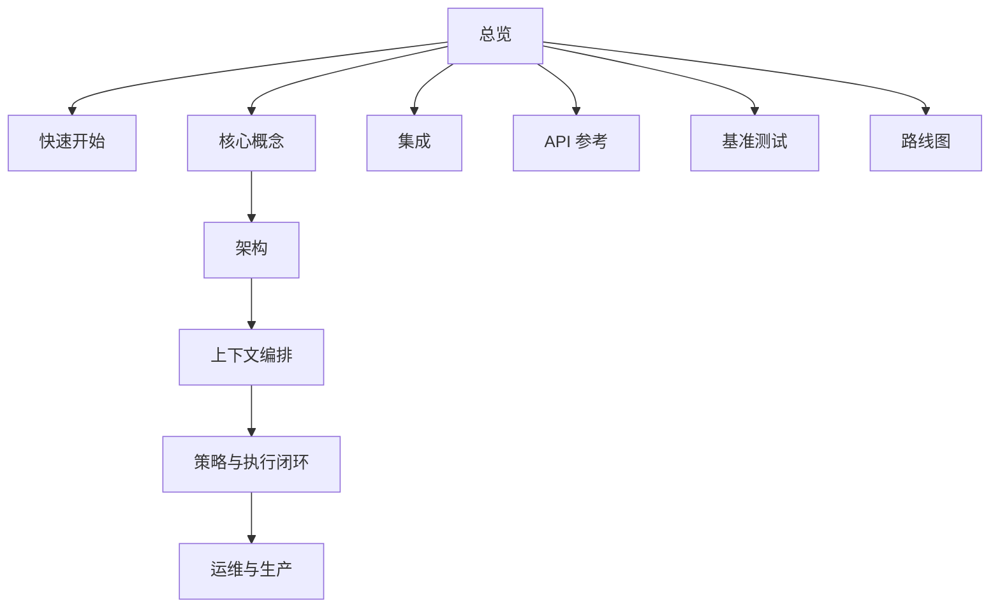

# 文档导航图

用本页快速找到最短阅读路径。

## 新用户（10 分钟）

1. [总览](/public/zh/overview/01-overview)
2. [5 分钟上手](/public/zh/getting-started/02-onboarding-5min)
3. [构建记忆工作流](/public/zh/guides/01-build-memory)
4. [按角色阅读路径](/public/zh/overview/03-role-based-paths)

## 生产接入（30 分钟）

1. [API 参考](/public/zh/api-reference/00-api-reference)
2. [SDK 指南](/public/zh/reference/05-sdk)
3. [上下文编排](/public/zh/context-orchestration/00-context-orchestration)
4. [策略与执行闭环](/public/zh/policy-execution/00-policy-execution-loop)

## 在线运维

1. [运维与生产](/public/zh/operate-production/00-operate-production)
2. [生产核心门禁](/public/zh/operations/03-production-core-gate)
3. [运维手册](/public/zh/operations/02-operator-runbook)
4. [Standalone 到 HA 手册](/public/zh/operations/06-standalone-to-ha-runbook)

## 信息架构总览

## 类别提醒

Aionis 不只是检索工具，而是 Memory Kernel。文档按完整闭环组织：

`Memory -> Policy -> Action -> Replay`
