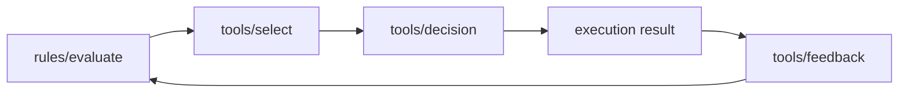

# 策略与执行闭环

Aionis 的策略闭环决定“记忆如何影响执行行为”。

## 闭环阶段

1. 基于运行上下文评估规则。
2. 在策略约束下选择工具。
3. 记录决策溯源。
4. 写入结果反馈。
5. 在后续运行中复用更新后的策略信号。

## 规则生命周期

1. `draft`：候选规则定义。
2. `shadow`：观测评估，不强制执行。
3. `active`：参与生产决策。
4. `disabled`：保留审计，不参与路由。

## 控制目标

1. 相比纯检索路由，提高成功率与稳定性。
2. 通过决策/规则链路保证可解释。
3. 通过门禁控制策略演进风险。

## 核心运营指标

1. 决策关联覆盖率。
2. 反馈关联覆盖率。
3. 负向结果比例漂移。
4. 活跃规则新鲜度与陈旧度。

## 推荐上线方式

1. 新规则先走 shadow。
2. 用执行门禁与适配门禁验证。
3. 通过阈值后再升 active。
4. 上线窗口保留回滚载荷。

## 从这里开始

1. 先规范 planner context。
2. 先接 `rules/evaluate` 再接 `tools/select`。
3. 持久化 `request_id`、`run_id`、`decision_id`。

## 下一步

1. [执行循环门禁](/public/zh/control/03-execution-loop-gate)
2. [策略适配门禁](/public/zh/control/04-policy-adaptation-gate)
3. [生产核心门禁](/public/zh/operations/03-production-core-gate)
